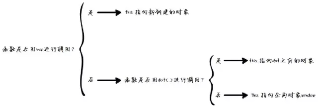
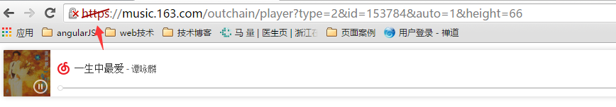

### this判断小窍门
> 是否new进行调用？
是-->this指向new对象
否-->函数是否用dot()调用？
是-->this指向dot之前的对象
否-->this指向全局对象window



### 如何给网页添加背景音乐
> 网易云音乐：
打开网页版网易云音乐,点音乐封面到歌词具体页面,点击生成外部链接,复制代码到md页面即可,最好放在页面底部;
若版权保护不支持生成链接,可以试试下载音乐后,用HTML的audio标签来播放,前提是将需要的音频先放在本地文件夹,上传到github会很费时,不建议;
注意：用audio标签需要controllers/autoplay属性,只用autoplay属性进入页面会有音乐,但是看不见控制界面,如果电脑开了音乐软件的话,会以为电脑有问题- -

### 音频没有显示并报错：
```javascript
Mixed Content: The page at 'https://wuhencut.github.io/2016/08/22/8-22-8-26%E8%87%AA%E5%AD%A6%E7%AC%94%E8%AE%B0/' was loaded over HTTPS,
but requested an insecure image 'http://s4.music.126.net/style/web2/img/default/default_list.jpg?param=66y66'.
This content should also be served over HTTPS.
```
解决：http改成https,能用但是控制台会有警告(手机端无用);
```javascript
<iframe frameborder="no" border="0" marginwidth="0" marginheight="0" width=330 height=86 src="http://music.163.com/outchain/player?type=2&id=108918&auto=1&height=66"></iframe>
```
<iframe frameborder="no" border="0" marginwidth="0" marginheight="0" width=330 height=86 src="https://music.163.com/outchain/player?type=2&id=153784&auto=1&height=66"></iframe>

> flash控件

```javascript
<embed src="http://music.163.com/style/swf/widget.swf?sid=27602243&type=2&auto=1&width=320&height=66" width="340" height="86"  allowNetworking="all"></embed>
```
<embed src="http://music.163.com/style/swf/widget.swf?sid=27602243&type=2&auto=1&width=320&height=66" width="340" height="86"  allowNetworking="all"></embed>

### 上线到github出现新问题
> 因为github是服从https协议的,但是引用的这个163控件是http的,所以不能用,但是有个奇怪的事情：我把http写成https,电脑端能解析并播放,但是手机端显示空白;电脑端url栏显示的是：



> flash控件还是那个德行,浏览器有flash的支持,没的就GG,手机端统统不行,github上也显示不出来,上面flash控件代码下的空白就是flash控件,显示空白;

### 问题：为什么我把协议头http改成https,该链接还能使用,只是协议头http有红色斜杠;

