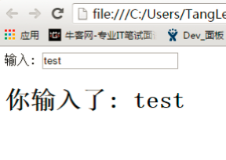
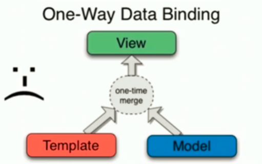
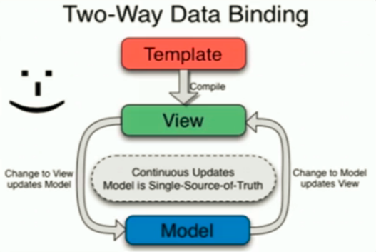
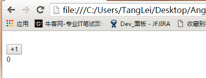
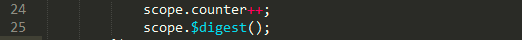
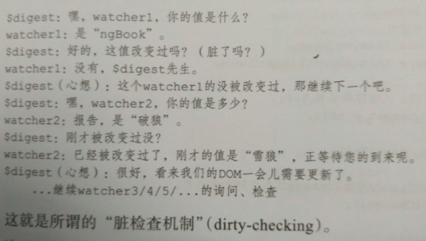
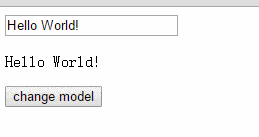
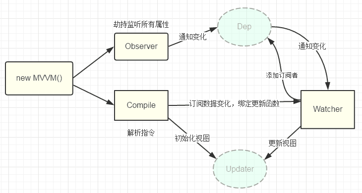
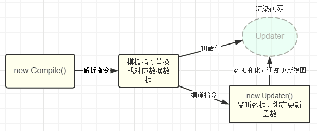

### Angular双向绑定
#### 1、什么是双向数据绑定
双向数据绑定：
Angular实现了双向绑定机制。所谓的双向绑定，无非是从界面的操作能实时反映到数据，数据的变更能实时展现到界面。即数据模型（Module）和视图（View）之间的双向绑定。
例子：
```javascript
<!DOCTYPE html>
<html>
<head>
<meta charset="utf-8">
<script src="http://apps.bdimg.com/libs/angular.js/1.4.6/angular.min.js"></script>
</head>
    <body>

        <div ng-app="myApp" ng-controller="myCtrl">
            输入: <input ng-model="name">
            <h1>你输入了: {{name}}</h1>
        </div>

        <script>
        var app = angular.module('myApp', []);
        app.controller('myCtrl', function($scope) {
            $scope.name = "test";
        });
        </script>
    </body>
</html>
```

当你在输入框中进行输入时，也会修改网页中的文本内容。
这里我使用了双大括号来实现了最简单数据绑定，双大括号进行的数据绑定时单向的，只实现了数据展示。然后我用input标签配合ng-model 实现了一个简单的双向数据绑定的例子，双向绑定最常用的场景就是表单，这样当用户在前端页面完成输入后，不用任何操作，我们就已经拿到了用户的数据存放到数据模型中了。

#### 2、双向数据绑定与单向数据绑定
单向数据绑定：


> 数据模型–>视图
  El表达式中常见 ${变量名}以及双大括号 ，它只提供从数据源到视图的单方向的数据展示。
  缺点：HTML代码一旦生成完以后，就没有办法再变了，如果有新的数据来了，那就必须把之前的HTML代码去掉，重新整合生成一次。

双向数据绑定：


> 数据模型<==>视图
  用户在视图上的修改会自动同步到数据模型中去，同样的，如果数据模型中的值发生了变化，也会立刻同步到视图中去。
  缺点：双向数据绑定的应用场景非常有限。

3、双向数据绑定原理
带着问题看下面的代码。
问题：绑定数据是怎么生效的？
如图示例，当点击+1按钮时，显示的数据是否会正常的增加？
如果会正常增加，说明原因。
如果不会，说明原因并修改代码使其可以正常显示。

```javascript
<!DOCTYPE html>
<html>
<head>
<meta charset="utf-8">
<script src="http://apps.bdimg.com/libs/angular.js/1.4.6/angular.min.js"></script>
</head>

    <body ng-app="test">
        <div ng-controller="CounterCtrl">
            <br>
            <button myclick>+1</button>

            <br>

            {{counter}}
        </div>
        <script>

            var app = angular.module("test", []);

            app.directive("myclick", function() {
                return function (scope, element, attr) {
                    element.on("click", function() {
                        scope.counter++;
                    });
                };
            });

            app.controller("CounterCtrl", function($scope) {
                $scope.counter = 0;
            });
        </script>
    </body>
</html>
```
上一段代码为无法实现页面显示数据增加的功能。
修改方法：

#### 原因从脏检查机制开始说起。
> 脏检查机制：Angular将双向绑定转换为一堆watch表达式，然后递归这些表达式检查是否发生过变化，如果变了则执行相应的watcher函数（指view上的指令，如ng-bind，ng-show等或是双大括号）。等到model中的值不再发生变化，也就不会再有watcher被触发，一个完整的digest循环就完成了。
  脏检查机制的触发：Angular中在view上声明的事件指令，如：ng-click、ng-change等，会将浏览器的事件转发给$scope上相应的model的响应函数。等待相应函数改变model，紧接着触发脏检查机制刷新view。
  所以，上文中的代码无法实现相应功能的原因就是缺乏触发Angular脏检查机制的条件，而手动添加了scope.$digest()使其执行了脏检查机制更新了view。
      watch表达式：可以是一个函数、可以是$scope上的一个属性名，也可以是一个字符串形式的表达式。$watch函数所监听的对象叫做watch表达式。
      watcher函数：指在view上的指令（ngBind，ngShow、ngHide等）以及双大括号表达式，他们所注册的函数。每一个watcher对象都包括：监听函数，上次变化的值，获取监听表达式的方法以及监听表达式，最后还包括是否需要使用深度对比（angular.equals()）。

### 脏检查机制（dirty-checking）是实现双向数据绑定的重要基础。
Angular中的$digest函数：当接受view上的事件指令转发的事件时，就会切换到Angular的上下文环境，来影响这类事件，$digest循环就会触发。
$digest函数的工作过程：

> 遍历一遍所有的watcher函数就是一轮脏检查，执行完一轮之后，只要有watcher监听的值改变过，那么就会重新在进行一轮，直到所有的值都没有变化。从第一轮到 所有数据稳定称为一个完整的$digest循环。当循环结束后，才把模型的变化结果更新到dom中去，防止频繁的dom操作。
  我们已经知道什么时候以及怎么开始digest循环了，那么digest循环具体做了些什么？
  在digest循环中，AngularJS会遍历整个$watch列表，所有watcher都会被触发，当一个wathcer被触发时，AngularJS会检测Scope模型相应的数据，如果它 发生了变化，那么关联到该watcher的回调函数就会被触发。
  如果执行了一次digest循环后某个值发生了变化，那么AngularJS会再次循环，直至不再有任何变化。这是因为你在$watch中更新某个值，如果该值对应的  $watch已在这遍循环通过，AngularJS将检测不到变化无法更新。如果循环运行了10次或更多次，AngularJS会抛出异常并停止。（就算没有更新值，AngularJS也会多运行一次来确保没有改变，也就是至少运行两次）。

  另一篇： http://blog.csdn.net/qq_20448859/article/details/52035873
  $watch： http://blog.csdn.net/u010451286/article/details/50635839
  http://www.jb51.net/article/123930.htm

以上就是Angular的数据双向绑定的原理。


### Vue双向绑定原理
原文地址： https://segmentfault.com/a/1190000006599500  （我这边再写一遍，加深记忆）
> 本文能帮你做什么？
  1、了解vue的双向数据绑定原理以及核心代码模块
  2、缓解好奇心的同时了解如何实现双向绑定
  为了便于说明原理与实现，本文相关代码主要摘自 <a href="https://github.com/vuejs/vue">vue源码</a>, 并进行了简化改造，相对较简陋，并未考虑到数组的处理、数据的循环依赖等，也难免存在一些问题，欢迎大家指正。不过这些并不会影响大家的阅读和理解，相信看完本文后对大家在阅读vue源码的时候会更有帮助<
  本文所有相关代码均在github上面可找到 https://github.com/DMQ/mvvm

相信大家对mvvm双向绑定应该都不陌生了，一言不合上代码，下面先看一个本文最终实现的效果吧，和vue一样的语法
```javascript
<div id="mvvm-app">
    <input type="text" v-model="word">
    <p>{{word}}</p>
    <button v-on:click="sayHi">change model</button>
</div>

<script src="./js/observer.js"></script>
<script src="./js/watcher.js"></script>
<script src="./js/compile.js"></script>
<script src="./js/mvvm.js"></script>
<script>
    var vm = new MVVM({
        el: '#mvvm-app',
        data: {
            word: 'Hello World!'
        },
        methods: {
            sayHi: function() {
                this.word = 'Hi, everybody!';
            }
        }
    });
</script>
```
效果：


#### 几种实现双向绑定的做法
> 目前几种主流的mvc(vm)框架都实现了单向数据绑定，而我所理解的双向数据绑定无非就是在单向绑定的基础上给可输入元素（input、textare等）添加了change(input)事件，来动态修改model和 view，并没有多高深。所以无需太过介怀是实现的单向或双向绑定。

实现数据绑定的做法有大致如下几种：
> 发布者-订阅者模式（backbone.js）
  脏值检查（angular.js）
  数据劫持（vue.js）

**发布者-订阅者模式:** 一般通过sub, pub的方式实现数据和视图的绑定监听，更新数据方式通常做法是 **vm.set('property', value)**，这里有篇文章讲的比较详细，有兴趣可点<a href="http://www.html-js.com/article/Study-of-twoway-data-binding-JavaScript-talk-about-JavaScript-every-day">这里</a>

这种方式现在毕竟太low了，我们更希望通过 vm.property = value 这种方式更新数据，同时自动更新视图，于是有了下面两种方式

**脏值检查:** angular.js 是通过脏值检测的方式比对数据是否有变更，来决定是否更新视图，最简单的方式就是通过 setInterval() 定时轮询检测数据变动，当然Google不会这么low，angular只有在指定的事件触发时进入脏值检测，大致如下：
- DOM事件，譬如用户输入文本，点击按钮等。( ng-click )
- XHR响应事件 ( $http )
- 浏览器Location变更事件 ( $location )
- Timer事件( $timeout , $interval )
- 执行 $digest() 或 $apply()

**数据劫持:** vue.js 则是采用数据劫持结合发布者-订阅者模式的方式，通过Object.defineProperty()来劫持各个属性的setter，getter，在数据变动时发布消息给订阅者，触发相应的监听回调。

#### 思路整理
已经了解到vue是通过数据劫持的方式来做数据绑定的，其中最核心的方法便是通过Object.defineProperty()来实现对属性的劫持，达到监听数据变动的目的，无疑这个方法是本文中最重要、最基础的内容之一，如果不熟悉defineProperty，猛戳<a href="https://developer.mozilla.org/zh-CN/docs/Web/JavaScript/Reference/Global_Objects/Object/defineProperty">这里</a>
整理了一下，要实现mvvm的双向绑定，就必须要实现以下几点：
1、实现一个数据监听器Observer，能够对数据对象的所有属性进行监听，如有变动可拿到最新值并通知订阅者
2、实现一个指令解析器Compile，对每个元素节点的指令进行扫描和解析，根据指令模板替换数据，以及绑定相应的更新函数
3、实现一个Watcher，作为连接Observer和Compile的桥梁，能够订阅并收到每个属性变动的通知，执行指令绑定的相应回调函数，从而更新视图
4、mvvm入口函数，整合以上三者

上述流程如图所示：


### 1、实现Observer
ok, 思路已经整理完毕，也已经比较明确相关逻辑和模块功能了，let's do it
我们知道可以利用Obeject.defineProperty()来监听属性变动
那么将需要observe的数据对象进行递归遍历，包括子属性对象的属性，都加上 setter和getter
这样的话，给这个对象的某个值赋值，就会触发setter，那么就能监听到了数据变化。。相关代码可以是这样：
```javascript
var data = {name: 'stone'};
observe(data);
data.name('rivers');

function observe(data){
    if(!data || typeof data !== 'object'){
        return;
    }
    // 取出所有属性遍历
    Object.keys(data).forEach(function(key){
        defineReactive(data, key, data[key]);
    });
};
function defineReactive(data, key, val){
    observe(val);
    Object.defineProperty(data, key, {
        enumerable: true, //可枚举
        configurable: false, //不可再define
        get: function(){
            return val;
        },
        set: function(newVal){
            alert('属性被劫持' + val + '--->' + newVal);
            console.log('值被修改:', val, '---->', newVal);
            val = newVal;
        }
    });
}
```

这样我们已经可以监听每个数据的变化了，那么监听到变化之后就是怎么通知订阅者了，所以接下来我们需要实现一个消息订阅器，很简单，维护一个数组，用来收集订阅者，数据变动触发notify，再调用订阅者的update方法，代码改善之后是这样：

```javascript
// ... 省略
function defineReactive(data, key, val) {
    var dep = new Dep();
    observe(val); // 监听子属性

    Object.defineProperty(data, key, {
        // ... 省略
        set: function(newVal) {
            if (val === newVal) return;
            console.log('哈哈哈，监听到值变化了 ', val, ' --> ', newVal);
            val = newVal;
            dep.notify(); // 通知所有订阅者
        }
    });
}

function Dep() {
    this.subs = [];
}
Dep.prototype = {
    addSub: function(sub) {
        this.subs.push(sub);
    },
    notify: function() {
        this.subs.forEach(function(sub) {
            sub.update();
        });
    }
};
```

那么问题来了，谁是订阅者？怎么往订阅器添加订阅者？
没错，上面的思路整理中我们已经明确订阅者应该是Watcher, 而且var dep = new Dep();是在 defineReactive方法内部定义的，所以想通过dep添加订阅者，就必须要在闭包内操作，所以我们可以在 getter里面动手脚：
```javascript
// Observer.js
// ...省略
Object.defineProperty(data, key, {
    get: function() {
        // 由于需要在闭包内添加watcher，所以通过Dep定义一个全局target属性，暂存watcher, 添加完移除
        Dep.target && dep.addDep(Dep.target);
        return val;
    }
    // ... 省略
});

// Watcher.js
Watcher.prototype = {
    get: function(key) {
        Dep.target = this;
        this.value = data[key];    // 这里会触发属性的getter，从而添加订阅者
        Dep.target = null;
    }
}
```
这里已经实现了一个Observer了，已经具备了监听数据和数据变化通知订阅者的功能，<a href="https://github.com/DMQ/mvvm/blob/master/js/observer.js"></a>完整代码。那么接下来就是实现Compile了

### 2、实现Compile
compile主要做的事情是解析模板指令，将模板中的变量替换成数据，然后初始化渲染页面视图，并将每个指令对应的节点绑定更新函数，添加监听数据的订阅者，一旦数据有变动，收到通知，更新视图，如图所示：

因为遍历解析的过程有多次操作dom节点，为提高性能和效率，会先将跟节点el转换成文档碎片fragment进行解析编译操作，解析完成，再将fragment添加回原来的真实dom节点中
```javascript
function Compile(el) {
    this.$el = this.isElementNode(el) ? el : document.querySelector(el);
    if (this.$el) {
        this.$fragment = this.node2Fragment(this.$el);
        this.init();
        this.$el.appendChild(this.$fragment);
    }
}
Compile.prototype = {
    init: function() { this.compileElement(this.$fragment); },
    node2Fragment: function(el) {
        var fragment = document.createDocumentFragment(), child;
        // 将原生节点拷贝到fragment
        while (child = el.firstChild) {
            fragment.appendChild(child);
        }
        return fragment;
    }
};
```

compileElement方法将遍历所有节点及其子节点，进行扫描解析编译，调用对应的指令渲染函数进行数据渲染，并调用对应的指令更新函数进行绑定，详看代码及注释说明：
```javascript
Compile.prototype = {
    // ... 省略
    compileElement: function(el) {
        var childNodes = el.childNodes, me = this;
        [].slice.call(childNodes).forEach(function(node) {
            var text = node.textContent;
            var reg = /\{\{(.*)\}\}/;    // 表达式文本
            // 按元素节点方式编译
            if (me.isElementNode(node)) {
                me.compile(node);
            } else if (me.isTextNode(node) && reg.test(text)) {
                me.compileText(node, RegExp.$1);
            }
            // 遍历编译子节点
            if (node.childNodes && node.childNodes.length) {
                me.compileElement(node);
            }
        });
    },

    compile: function(node) {
        var nodeAttrs = node.attributes, me = this;
        [].slice.call(nodeAttrs).forEach(function(attr) {
            // 规定：指令以 v-xxx 命名
            // 如 <span v-text="content"></span> 中指令为 v-text
            var attrName = attr.name;    // v-text
            if (me.isDirective(attrName)) {
                var exp = attr.value; // content
                var dir = attrName.substring(2);    // text
                if (me.isEventDirective(dir)) {
                    // 事件指令, 如 v-on:click
                    compileUtil.eventHandler(node, me.$vm, exp, dir);
                } else {
                    // 普通指令
                    compileUtil[dir] && compileUtil[dir](node, me.$vm, exp);
                }
            }
        });
    }
};

// 指令处理集合
var compileUtil = {
    text: function(node, vm, exp) {
        this.bind(node, vm, exp, 'text');
    },
    // ...省略
    bind: function(node, vm, exp, dir) {
        var updaterFn = updater[dir + 'Updater'];
        // 第一次初始化视图
        updaterFn && updaterFn(node, vm[exp]);
        // 实例化订阅者，此操作会在对应的属性消息订阅器中添加了该订阅者watcher
        new Watcher(vm, exp, function(value, oldValue) {
            // 一旦属性值有变化，会收到通知执行此更新函数，更新视图
            updaterFn && updaterFn(node, value, oldValue);
        });
    }
};

// 更新函数
var updater = {
    textUpdater: function(node, value) {
        node.textContent = typeof value == 'undefined' ? '' : value;
    }
    // ...省略
};
```
这里通过递归遍历保证了每个节点及子节点都会解析编译到，包括了双大括号表达式声明的文本节点。指令的声明规定是通过特定前缀的节点属性来标记，如<span v-text="content" other-attr中v-text便是指令，而other-attr不是指令，只是普通的属性。
监听数据、绑定更新函数的处理是在compileUtil.bind()这个方法中，通过new Watcher()添加回调来接收数据变化的通知

至此，一个简单的Compile就完成了，<a href="https://github.com/DMQ/mvvm/blob/master/js/compile.js">完整代码</a>。接下来要看看Watcher这个订阅者的具体实现了