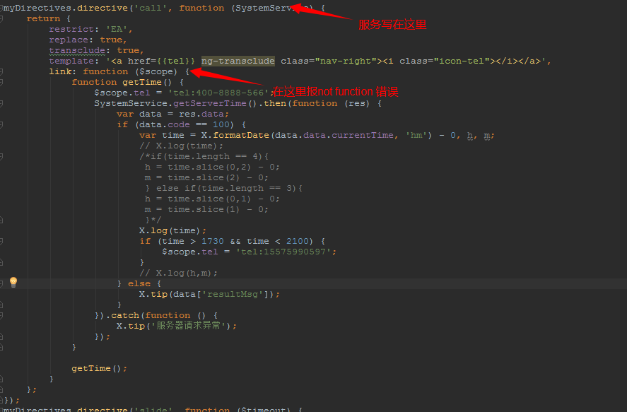

#### 指令模板：template，回调函数：link.在link中可执行请求，请求的服务写在最外层，看图

#### angular自带的9种过滤器
```
{{num | number : 2}}  格式化数字后并保留两位小数并每三位加逗号。{{num | number}} 不对数字进行小数点处理，每三位加逗号
```
<a href="http://www.cnblogs.com/zhujierong/p/6136716.html">angular自带的9种过滤器</a>

#### ng-class
```
ng-class="{'txt-red': true,'txt-gray':false}" 当true时，显示红色，当false时显示灰色
```

#### ng-bind
```
ng-bind="{'0':'GO','1':'完成','2':'已领'}[item.status]  期货1.1acPacket页面，可省略不少代码
```

#### goURL问题
> 当goURL页面本身带参数，而且该页面需要登录。页面数据又根据?的参数来获取，会导致?goURL=***?***、第二个?后重要的参数会被抹去不见。解决：1、goURL跳转登录的时候自己写清楚，2、ctrl里写清楚，当参数不穿的时候默认是什么值。

#### ng-repeat遍历如何在子列表中展示数据
```javascript
ng-repeat="item in items",     exm : <ul ng-repeat="item in items"><li>{{item.data}}</li></ul>  其中的item可用this代替，因为this指向item(双向绑定)
```

#### 原生js导致操作不受$scope控制
```javascript
由于弹窗的组件都是由原生js写的，会导致操作跳出$scope作用域，操作不收控制
解决:将操作绑定回$scope,
$scope.$apply(function(){
      ************
});
```

#### T+1买断多个弹窗，当提醒弹窗到买断信息弹窗出现一闪
> 由于第一个弹窗结束，背景消失，第二个弹窗出现，背景也出现，所以导致一闪，
  解决：在一个个弹窗结束的“确定操作”用，设置背景为true，就不消失，不会闪了。

#### $watch
> 它接受两个函数作参数，把它们存储在$$watchers数组中。我们需要在每个Scope实例上存储这些函数，所以要把它放在Scope的原型上

#### $digest
> 它执行了所有在作用域上注册过的监听器。我们来实现一个它的简化版，遍历所有监听器，调用它们的监听函数

#### angualr脏检查
> 浏览器有提供用户触发时间的API如click,change等等，但是内存->用户，浏览器没有提供数据监测的API，所以任何内存数据变动(定时，异步请求，时间出发等等)都无法被监听。自然也没有办法处理callback。但是我们给予这些大部分能产生出具变动的时间进行封装(click，mouse-over，time-out)，在每次时间发生后，执行完时间后检查一遍数据的变化，如果数据和上次的值有变化，则执行这个值(注册时)对应的callback(框架中)，这个callback可能是view层的一个数据表现，也可能是一段处理的function。在检查数据变化的时候由于你并不知道这个事件对那些数据进行了更改，所以必须进行一次大检查，将所有"注册"过的值全都检查一遍，一次检查称为一个周期，每次至少检查两遍，因为第二遍用来确认，前一遍的变动中是否有数据的变动，导致了其他数据的变动，如果有变动则再进行一次。知道最后两次完全一致，脏检查每个周期最多递归10遍。

#### 图片验证码防止被刷接口
> 之前做正则判断只要不是4个数字就会发起请求。现在做处理：不是四个数字的不发起请求来验证是否正确，四个数字才发起

#### 图片验证码如何刷新
> json？v=time     每次验证码不通过，更新时间即可，angular会更具双向绑定来再次检测不同，然后发起请求。

#### 给鑫谷做一个分包
> 根据#/index/agentCode  的agentCode来区分代理包，如果只是#/index则为YZTZ。之后如果有代理包，只要把agentCode改掉就好

#### angular如何设置cookie
> angular有两种设置cookie的方式：$cookies和$cookieStore，设置方式：$cookies.put(name , value), 取值：get(),删除：remove()；
  差别：$cookies对name设置字符串属性的值，$cookieStore能对name设置对象，字符串，数组形势的值。
  $cookies可以对cookie设置过期时间，另一个不可以  具体资料链接：http://www.cnblogs.com/yangmin01/p/5973883.html
  var expireDate = new Date();
  expireDate.setDate(expireDate.getDate() + 1);
  $cookies.put("userName",“yangmin”,{'expires': expireDate});//“userName”一天后过期

#### 指令可以异步获取数据并显示
> 详情看微策略4.0版本的cldt指令代码，通用于各个点买一级页面需要用到的模块