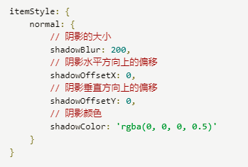
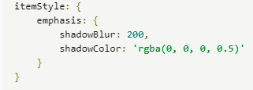
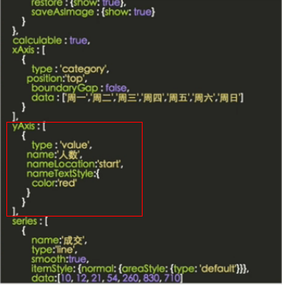
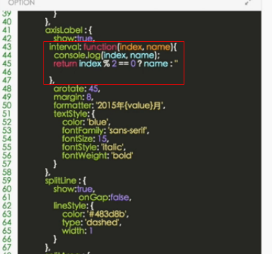

#### echarts样式设置
 itemStyle   naomal：正常显示
  
 emphasis: emphasis是鼠标 hover 时候的高亮样式
 

#### xAxis, yAxis
> 横坐标      纵坐标

#### loading动画
```javascript
myChart.showLoading() -- myChart.hideLoading()
```

#### boundaryGap: [0, '100%'],
> 设置y轴的最高范围比数据显示的最大值高多少的距离， []内的值可以随意调整

#### echarts自适应
> 窗口大小变化自适应：window.onResize = myChart.resize

#### grid
> x,y左上角坐标位置，x2,y2右下角坐标位置，当设置width和height后，自动忽略x2,y2。x和y依然有效

#### yAxis的type为value和time时才可以设置name
> 默认在end(y轴最上方)


#### boundaryGap
> 图表的左右留白，折线图一般不用留白，设置false即可，如果是y轴的话设置数组。[0,0.x]，上下留白

#### scale
> 摆脱0值，最小值不为0，设置为true即可，在K线图中有用

#### splitNumber
> 分成多少份来分割

#### onzero
> 是否显示0值线

#### axisTick
> 坐标轴的每个点的标记样式设计，

#### onGap
> 坐标标记点的值是否显示在区域中间

#### splitLine
> 区域内分割线，x,y轴都有 也有onGap参数

#### axisLable
> 标记点的内容，参数：interval： auto：自动隐藏，数值：0-x。多少个显示，一般auto即可
  还可以function


#### echarts数据相关设置
> 放在series的data里

#### symble
> 折线图拐点

#### label
> 拐点文字

#### echarts问题：对时间处理
> 用X.formatDate(value, pattern);来处理，把时间处理成1745(17:45)这种形式来


