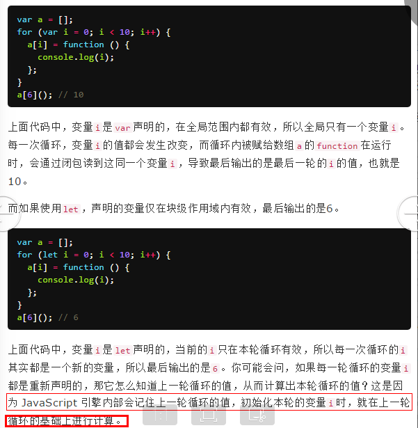
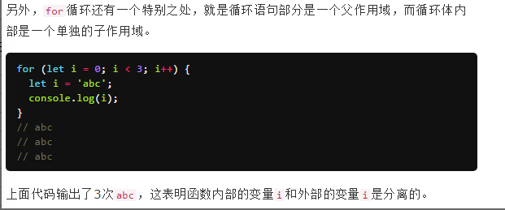
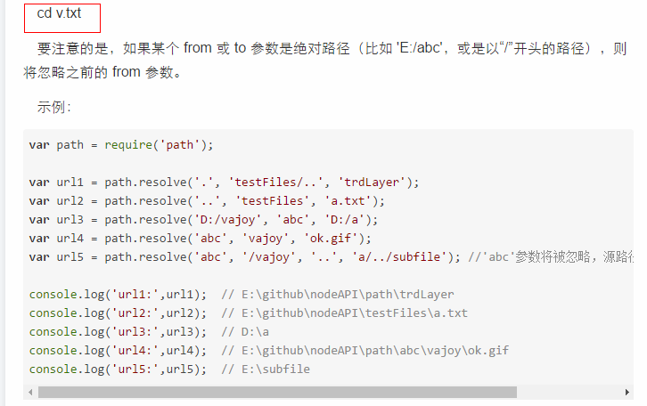
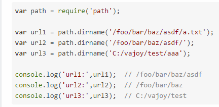
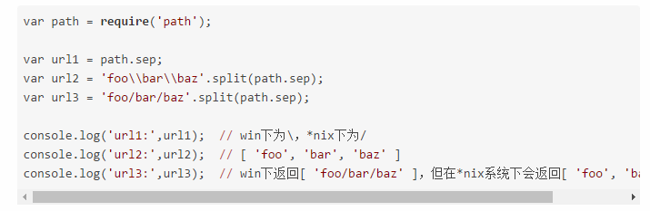
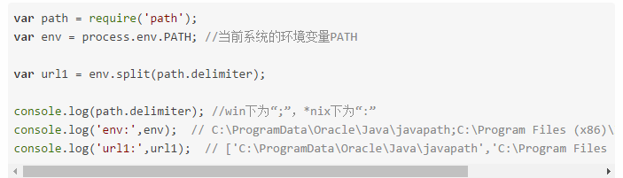
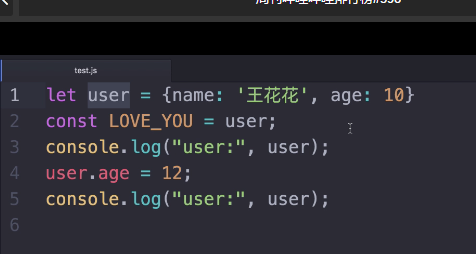

#### let与var的区别

#### Promise
> Promise 的主要作用就是用于封装异步操作，以便根据异步操作是否成功来进行后续的操作。

  后续操作是通过 then() 和 catch() 来申明的，但是如何触发，以及应该触发成功还是失败呢？这就靠 resolve 和 reject 这两个函数了，在 Promise 对象产生时，它们是为作封装的函数的参数的

#### node
> var path = require('path');

##### path.resolve

> 相当于CD，看不懂看 <a href="http://www.tuicool.com/articles/3qia6zz">链接</a>

##### path.isAbsolute(path)
> 判断 path 是否绝对路径。这块可以理解为，path 是否真的是一个绝对路径（比如 'E:/abc'），或者是以“/”开头的路径，二者都会返回true：

##### path.dirname(p)
> 返回路径中文件夹的路径

##### path.basename(p, [ext])
> 返回路径中的最后一部分，类似于Unix 的 basename 命令。 ext 为需要截掉的尾缀内容

##### path.extname(p)
> 返回路径文件中的扩展名（若存在）

##### path.sep
返回对应平台下的文件夹分隔符，win下为'\'，*nix下为'/'

##### path.delimiter
> 返回对应平台下的路径分隔符，win下为';'，*nix下为':'

##### require ecports module.ecports
> require 用来加载代码，而 exports 和 module.exports 则用来导出代码。
1、module.exports 初始值为一个空对象 {}
2、exports 是指向的 module.exports 的引用
3、require() 返回的是 module.exports 而不是 exports

##### exports 与 module.exports
https://cnodejs.org/topic/5231a630101e574521e45ef8
https://cnodejs.org/topic/52308842101e574521c16e06
> 1.module.exports 初始值为一个空对象 {}
  2.exports 是指向的 module.exports 的引用
  3.require() 返回的是 module.exports 而不是 exports

##### __filename
> Node.js中，在任何模块文件内部，可以使用__filename变量获取当前模块文件的带有完整绝对路径的文件名。

##### __dirname
> 获得当前文件所在目录的完整目录名

#### key
> 当你不需要想某个模块进行复用(input)而需要重新渲染，可在元素内(<input placeholder="Enter your email address" key="email-input">)
  添加key值

#### slice
> slice() 方法返回一个从开始到结束（不包括结束）选择的数组的一部分浅拷贝到一个新数组对象。原始数组不会被修改

#### splice
> splice() 方法通过删除现有元素和/或添加新元素来更改一个数组的内容。  会修改调用的数组

#### fetch

#### promise
链接：http://www.jianshu.com/p/063f7e490e9a
个人理解：promise是异步请求发起时携带的一个对象。三个状态，不可变：pending,reject,resolve。promise.then(处理success，也可以return另外一个promise来处理多层嵌套ajax).catch(处理error)

#### getter/setter
链接：https://segmentfault.com/a/1190000007356931

#### websockets
红宝石书上也有
> 链接：https://www.zhihu.com/question/20215561

#### 当有个值有可能为空时
> 必须加 ||''   必须有有空字符串符号，不然很有可能有意想不到的错误

#### 为什么this不能替代vm
> 在2.0版本中，mounted方法取代了ready方法，后者：实例全然完成，实例插入dom中，所以在1.0中用vm替代this是没毛病的，但是在2.0中，你调用mounted的时候很有可能实例并没有插入到dom中，所以为了让vm能替代this，必须确保vm实例已经插入dom中，取药调用方法：this.nextTick(function(){你要写的方法：vm.xx();})
  但是一般用this没有什么不妥，也没有必要非得为了用vm而用vm，只是提醒注意。

#### 箭头函数的this指向外层
> 不像es5的func内的this指向局部函数作用域

#### export和export default的区别
> export const生命一个变量，在其他文件中当如要用：import {xx} from 'xxxxxxx'的形式来导入，一个js文件中可以有多个
  export default一个文件中只能有一个，它导出的是一个对象，形式：import x from，要用到其中的方法的话，就用x.xxx等

#### _ 不会修改变量。nodejs

#### const
> const指定一个值后，再被赋值就会报错，但是你讲指针的变量改变了就没问题，相当于你买了一台电视机，你不能换电视，但是你能换电视节目；如右图改动是有效果的

