#### 当多个头部固定切下面可滑动（微策略点卖点买结算页面，头部接个组件固定）
> 多个头部固定，且下面可滑动时，用div将要固定的div包裹住，设置高度即可。固定部分高度与外部高度一致，内部可流水布局，第二个固定头部也这么多，这么做的好处：用外层的流水布局将多个固定布局的流水展示，这样就不用设置多个fixed的top值。且下面是可滑动的，上面的外层流布局会被顶上去，所以，外层流布局只是当做将内容撑开的作用。然后将固定部分设置高z-index，这样当下面滑动至超出顶部时不会显示出来。详细可见微策略3.2版本的公告，TDTrade的头部等等。具体代码看下面
```
.user-tips .amount-tips {
    height: 0.43rem;
}

.user-tips .amount-tips .outer-tip {
    position: fixed;
    height: 0.43rem;
    width: 100%;
    background-color: #0E1821

}

.user-tips .amount-tips .tips-warp {
    display: table;
    width: 100%;
    height: 0.43rem;
    z-index: 90;
}

.user-tips .amount-tips .tips-warp li {
    display: table-cell;
    padding: 0.1rem 0 0 0.2rem;
}

.user-tips .lossgain-tip {
    display: block;
    height: 0.6rem;

}

.user-tips .lossgain-tip .tip-content {
    background-color: #E2E2E2;;
}
```
outer-tip就是那个用来撑开高度用的。内部负责定位显示什么的

#### p标签不可包裹div
> 根据标准不合法，p标签只可以包裹比他小等级的标签。

#### 换行：
word-break:break-all;overflow对数字没用。

#### 背景图靠右一定距离
```
background: url() no-repeat right 0.1rem(你要设置的距离) center;
```
#### 图片在div容器中会留白
> img默认属性是inline-block，在div容器中会留白，设置成block即可

#### 背景有图和颜色
```
background: url("./images/icon-head.png") 0.15rem center no-repeat #FFFFFF;  （微策略myInfo页面头部就是这么做的）
颜色用来设置背景色，图片用来设置背景图片，当然背景图还要设置background-size;
```

#### 元素有个能为空而不占据高度
```
<p class="desc"  ng-bind="item.description ||'&nbsp;'">{{item.description}}</p>   ng-bind绑定一个空格，使其不为空
```

#### SVG 有预定义的形状元素
<text><g><tspan>都属于svg标签
> 矩形 <rect>  rx,ry表示圆角大小
  圆形 <circle>
  椭圆 <ellipse>  cx，cy表示圆心坐标，rx,ry表示横/纵向半径
  线 <line>
  折线 <polyline>
  多边形 <polygon>
  路径 <path>
  http://www.w3school.com.cn/svg/svg_rect.asp

#### svg描边问题
> svg画边框不同于一般的div画边框，svg以某个中心轴往两边各画一像素，所以，如果以整数为中心轴画的话会出现两像素渐变的边框，故取x.5为中心轴往两边画1px，由于多出0.5px，不会画，所以显示1px。是kline里画k线图为什么要加0.5px的问题所在

#### 火狐浏览器<a>标签问题
> 该浏览器的h5页面中如果包含<a href="" ****>，如果href为空，会刷新当前页面

#### 微策略周/月K线图优化问题
> 之前由于切换tab时两个问题：
  1、多个klineChart。K线图会重复画，前K线图并不会消失，导致切换后的K线图画到下面的bug。我当时的处理：将klineChart ，**Chart，CACHE_KLINE， CACHE_***设置为null，切**chart设置了ng-if来控制显示。次方法解决了重复画制的问题，但是新问题：由于设置null，每次切换tab都会请求接口，造成服务器压力。
  2、只有一个chart.切换多次tab后，切换无效果。原因：drawKline（）只在getKlineData中执行。所以当CACHE_***都不为空的时候，klineChart不会被重新画制了。解决：在changeTab()方法中添加判断，当current == *** && CAHCE_***时执行 drawKline(CACHE_***,current)


#### IE内核情况下<a>标签的问题
> 当<a>标签中有标签时，会出现蓝色边框，亲测chrome，Firefox没问题，电脑自带的edge也没问题，可能是360内核的IE版本有问题
  解决办法：给img边框设置为0
  当IE浏览器下，a标签点击后出现虚线边框问题。解决：a:focus{outline:0}

#### 网页被卷去高度各个语法
```
document.body.scrollTop: 网页被卷去的高
document.body.offsetHeight: 网页可见区域高
document.body.clientHeight: 网页可见区域高
document.body.clientWidth: 网页可见区域宽
document.body.offsetWidth: 网页可见区域宽：(包括边线的宽);
```
详见： <a href="http://www.cnblogs.com/xiaowei661/archive/2011/06/03/2070201.html">网页被卷去高度各个语法</a>

#### viewBox(svg知识)
> viewBox="x, y, width, height"  // x:左上角横坐标，y:左上角纵坐标，width:宽度，height:高度  <symbol viewBox="0 0 33 32" id="rating"></symbol>  <svg viewBox="0 0 30 30"></svg>

#### addEVentListener()
> element.addEventListener(event, function, useCapture)

#### useCapture
> bool值 ，true :事件在捕获时执行   false ： 事件在冒泡时执行

#### 正则表达式
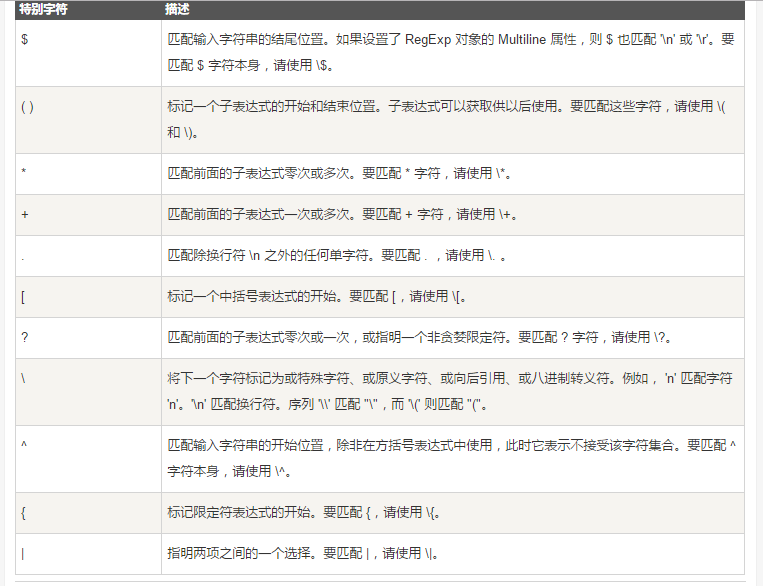

#### == 和 === 的区别
== 在变量赋值时内存会存储值的类型；做双等号比较操作时，会先做**临时类型转换**再做比较，内存中存储的值还是原来的不会改变
双等号会造成类型转换，推荐一律使用三等号
js中用==会造成**类型**的转换，对后续代码会不会造成以外的影响？
https://www.zhihu.com/question/31442029

##### ==
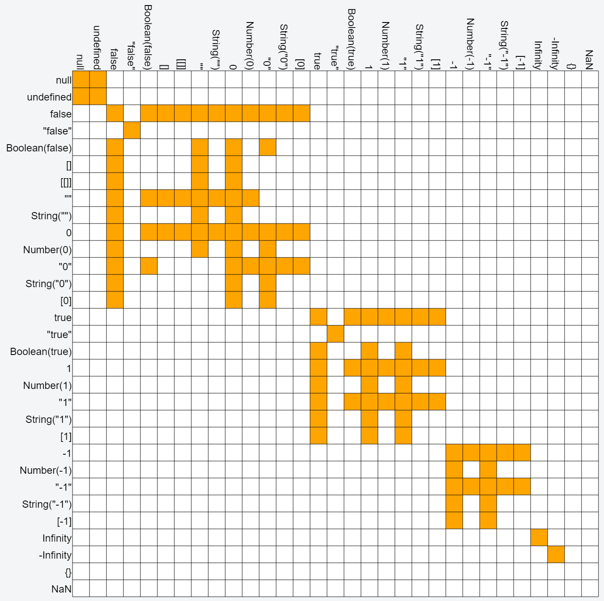
##### ===
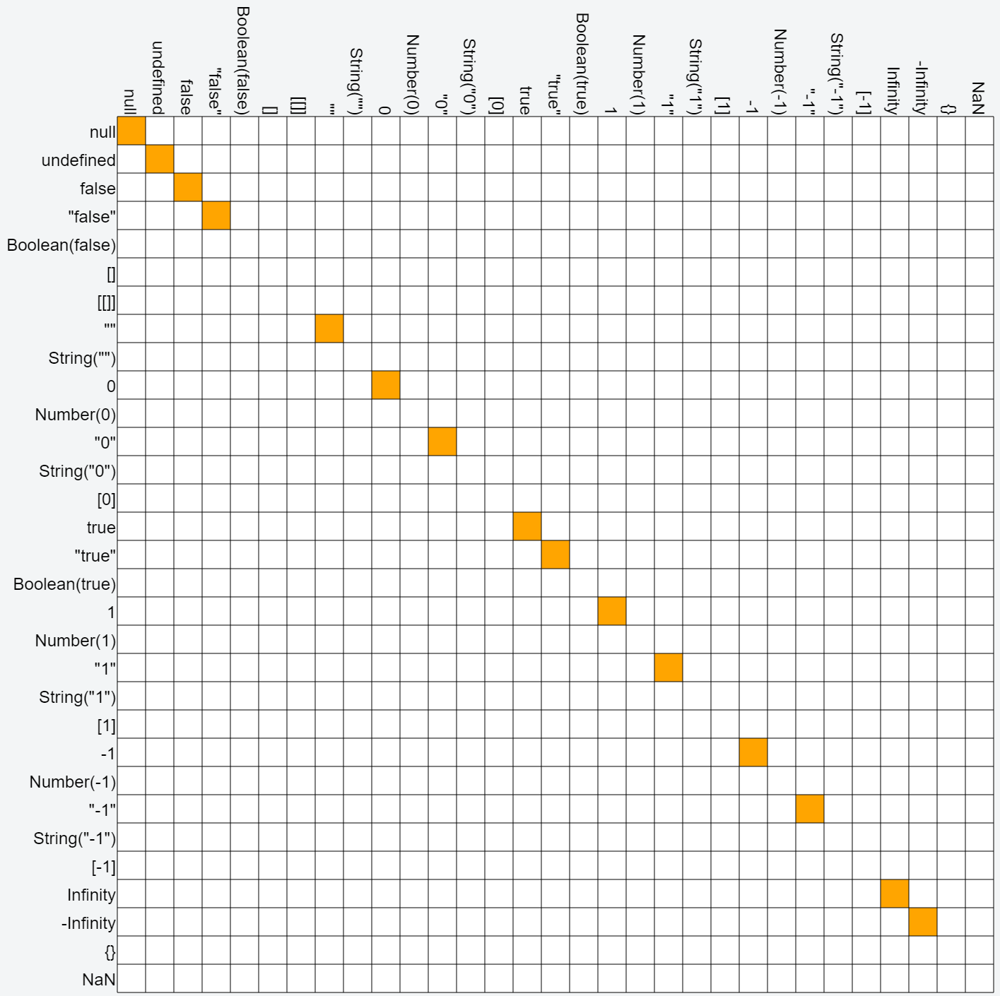

#### meta - viewport
```javascript
<meta name="viewport" content="width=device-width,height=device-height,initial-scale=1.0, minimum-scale=1.0, maximum-scale=1.0, user-scalable=no">
1.width=device-width    //应用程序的宽度和屏幕的宽度是一样的
2.height=device-height  //应用程序的高度和屏幕的高是一样的
3.initial-scale=1.0  //应用程序启动时候的缩放尺度（1.0表示不缩放）
4.minimum-scale=1.0  //用户可以缩放到的最小尺度（1.0表示不缩放）
5.maximum-scale=1.0  //用户可以放大到的最大尺度（1.0表示不缩放）
6.user-scalable=no  //用户是否可以通过他的手势来缩放整个应用程序，使应用程序的尺度发生一个改变
```

#### Mixin
> 解决多重继承问题  具体链接：https://www.zhihu.com/question/20778853
  理解：一个类有多个父类，这些父类又有自己的父类,为了利用多重继承的有点又解决缺点时，有了规格继承和实现继承(Mixin)
  规格：方法名相同。    实现：方法名，方法都要相同。            前者 ： I am      后者 I can

#### Meta标签中format-detection属性及含义
> content="telephone = no"iPhone中会将一串数字自动变成电话号码，点击的时候会弹出确认拨打的功能
  conteng="email = no"   告诉设备不识别邮箱，点击之后不自动发送  email=no禁止作为邮箱地址！ email=yes就开启了把文字默认为邮箱地址，这个meta就不用写了,在默认是情况下就是开启！
  content = "address = no"    adress=no禁止跳转至地图！   adress=yes就开启了点击地址直接跳转至地图的功能,在默认是情况下就是开启！

#### Meta http-equiv属性详解
> http-equiv属性语法格式是：＜meta http-equiv="参数" content="参数变量值"＞ ；其中http-equiv属性主要有以下几种参数：
  Expires(期限)   : 可以用于设定网页的到期时间。一旦网页过期，必须到服务器上重新传输。
  Pragma(cache模式)  : 是用于设定禁止浏览器从本地机的缓存中调阅页面内容，设定后一旦离开网页就无法从Cache中再调出   注意：这样设定，访问者将无法脱机浏览。
  Refresh(刷新) :  自动刷新并指向新页面。  ＜meta http-equiv="Refresh" content="2；URL=http://www.net.cn/"＞    --------  其中的2是指停留2秒钟后自动刷新到URL网址。
  Set-Cookie(cookie设定)  : 如果网页过期，那么存盘的cookie将被删除 --- ＜meta http-equiv="Set-Cookie" content="cookievalue=xxx;expires=Wednesday, 20-Jun-2007 22:33:00 GMT； path=/"＞  ----------必须使用GMT的时间格式。
  Window-target(显示窗口的设定)  : 强制页面在当前窗口以独立页面显示。
  content-Type(显示字符集的设定)  : 设定页面使用的字符集。
  清除缓存（再访问这个网站要重新下载！）  :  <meta http-equiv="cache-control" content="no-cache">
  关键字,给搜索引擎用的  :  <meta http-equiv="keywords" content="keyword1,keyword2,keyword3">
  页面描述  : <meta http-equiv="description" content="This is my page">

####  Meta中添加X-UA-Compatible和IE=Edge，chrome=1
edge模式告诉浏览器以当前IE版本以最高级标准模式渲染，避免版本升级造成的影响  <meta http-equiv="X-UA-Compatible" content="IE=edge">
chrome = 1   强制 IE 使用 Chrome Frame 渲染   -----<meta http-equiv="X-UA-Compatible" content="chrome=1">

#### Meta标签中的apple-mobile-web-app-capable属性及含义
> 这meta的作用就是删除默认的苹果工具栏和菜单栏。  content有两个值”yes”和”no”,当我们需要显示工具栏和菜单栏时，这个行meta就不用加了，默认就是显示。
“apple-mobile-web-app-status-bar-style”作用是控制状态栏显示样式    ----- 基本无用

#### transform的属性及其方法
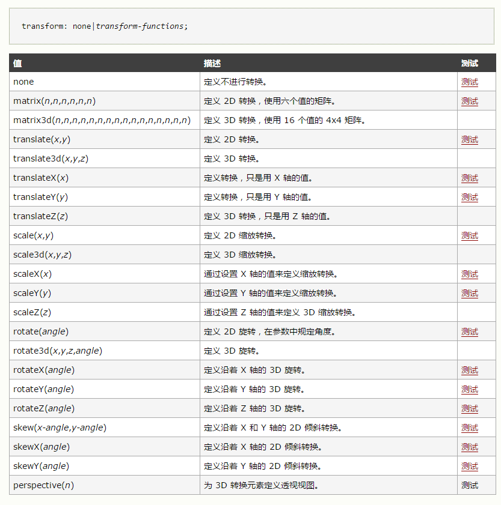

#### 对象遍历
```javascript
 for(var key in obj){}
```

#### getElementBy..和querySelector
> querySelector() 方法返回匹配指定 CSS 选择器元素的第一个子元素 。 该方法只返回匹配指定选择器的第一个元素。如果要返回所有匹配元素，需要使用 querySelectorAll() 方法替代．
  由于querySelector是按css规范来实现的，所以它传入的字符串中第一个字符不能是数字.
  最后再根据查询的资料总结一下：
  query选择符选出来的元素及元素数组是静态的，而getElement这种方法选出的元素是动态的。静态的就是说选出的所有元素的数组，不会随着文档操作而改变．
  在使用的时候getElement这种方法性能比较好，query选择符则比较方便．

#### flex layout
> 链接：http://blog.csdn.net/sinat_24044741/article/details/51737606
  stretch:填充，扩展。

#### func.bind(sth)()
> func.bind(sth)()，mozilla手册中提到bind是在ECMA-262 5th Edition中新增的一个特性，这里单独列出来作为一种调用方式是因为它弥补了直接调用中不能绑定作用域的缺陷。
  能绑定作用域

#### func.call()
> func.call()，这是第二种调用方式，**每个方法的原型中都定义了call方法，用来执行当前方法**。

#### func.apply()
> call的双胞胎兄弟   关于this : apply()是函数对象的一个方法，它的作用是改变函数的调用对象，它的第一个参数就表示改变后的调用这个函数的对象。因此，this指的就是这第一个参数。

#### 闭包
> 有权访问另一个函数作用域内变量的函数都是闭包

#### http请求的几种状态码
> 200：请求成功
  301：永久重定向
  302：临时重定向
  304：请求的内容没有修改过
  404：错误页面，不存在
  403：没有权限，拒绝访问
  500：服务器内部错误

#### ajax请求需要的参数
> type  : 请求的类型：GET / POST
  data ： 请求参数
  async  ： 是否异步
  datatype  ： 预期服务器返回的数据类型
  success  ： 请求成功后的回调函数
  url：请求地址

#### CSS中的伪类伪元素
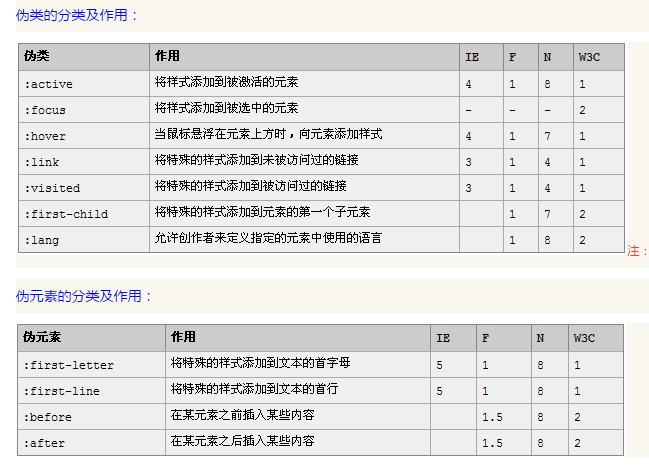

#### 结构性伪类选择器
> 结构性伪类选择器
   1.  四个最基本的：root、not、empty、target
   2. first-child、last-child、nth-child、nth-last-child、
  nth-child(odd)、nth-child(even)、nth-last-child(odd)、nth-last-child(even)
   3.  nth-of-type、nth-last-of-type
   4. 循环使用样式
   5. only-child

#### H5   CSS3新增标签和属性
链接：http://blog.csdn.net/qq_37811211/article/details/60880279
http://www.cnblogs.com/wuyanliang/p/5862643.html

#### 怎么判断一个object为空
```javascript
if(typeof(x) == "undefined") / if(typeof(x) != "object")  / if(!x)
```

#### 如何返回数组中元素的索引
普通：arr.indexOf(x)
二分法：只能适用于有序数组，
```javascript
arr，num，midIndex. if(arr[midIndex] > num){midIndex-- ,if(arr[midIndex] == num){return midIndex}else{midIdex++,if(arr[midIndex] == num){return midIndex}
```

#### js原型继承的几种方式
1. 原型链继承
```javascript
function show(){
	this.name = 'lee';
}

function run(){
	this.age = 20;//run继承了show，通过原型形成链条
}

run.prototype = new show();
var run1 = new run();
alert(run1.name);//lee
```
2，构造函数继承（对象冒充继承）//call,apply
为了解决引用共享和超类型无法传参的问题，我们采用一种叫借用构造函数的技术，或者成为**对象冒充**（伪造对象，经典继承）的技术来解决两种问题
```javascript
function box(age){
	this.name = ['stone', 'one', 'jack'];
	this.age = age;
}

function desk(age){
	box.call(this, age);//对象冒充，给超类型传参
}

var desk1 = new desk(200);
alert(desk1.name);//'stone', 'one', 'jack'
alert(desk1.age);//200
desk1.name.push('rivers');//添加新的数据，只给desk1
alert(desk1.name);//'stone', 'one', 'jack', 'rivers'
```
3，组合继承（原型链继承+构造函数继承）
借用构造函数虽然解决了刚才两种问题，但没有原型，复用则无从谈起。所以，我们需要原型链+借用构造函数的模式，这种模式为组合继承
```javascript
function box(age){
	this.name = ['stone', 'one', 'rivers'];
	this.age = age;
}

box.prototype.run = function(){
	return this.name + this.age;
}

function desk(age){
	box.call(this,age);//对象冒充
}

desk.prototype = new box();//原型链继承
var desk1 = new desk(200);
alert(desk1.run());
```
4，原型式继承
```javascript
function obj(o){//传递一个字面量函数
	function F(){}//创造一个构造函数
	F.prototype = o;//把字面量函数赋值给构造函数的原型
	return new F(); //最终犯坏实例化的构造函数
}

var box = {//字面量对象
	name: 'lee',
	arr: ['爸爸','妈妈','哥哥']
};

var box1 = obj(box);//传递
alert(box1.name);//lee
box1.name = 'jack';
alert(box1.name);//jack
alert(box1.arr);//'爸爸','妈妈','哥哥'
box1.arr.push('姐姐');
alert(box1.arr);'爸爸','妈妈','哥哥','姐姐'
var box2 = obj(box);
alert(box2.name);//lee
alert(box2.arr);//'爸爸','妈妈','哥哥'
```
5, 寄生组合式继承
寄生组合式继承解决了两次调用的问题，组合式继承就会有两次调用的情况
基本模型如下
```javascript
function obj(o){
	function F(){};
	F.prototype = o;
	return new F();
}

function inheritPrototype(subType, superType){
	var prototype = obj(superType.prototype);//创建对象
	prototype.constructor = subType;//增强对象
	subType.prototype = prototype;//指定对象
}

var a = {name : 'stone', age : 24}, b = {class: 'one', time: 25};
inheritPrototype(a,b);
```
#### 图片懒加载
> 当屏幕快滑动到图片显示区域的时候发起图片加载请求。详见：http://www.cnblogs.com/liliangel/p/6122836.html
  用到的库：jquery.lazyload.js或者echo.js（很小，压缩后不到1k,如果项目中没有jquery，推荐使用echo）

#### 同源
> 同源是指：js脚本只能访问或者请求相同协议，相同domain(网址/ip)，相同端口的页面。

#### HTTPS通信
> （1）客户使用https的URL访问Web服务器，要求与Web服务器建立SSL连接。
  （2）Web服务器收到客户端请求后，会将网站的证书信息（证书中包含公钥）传送一份给客户端。
  （3）客户端的浏览器与Web服务器开始协商SSL连接的安全等级，也就是信息加密的等级。
  （4）客户端的浏览器根据双方同意的安全等级，建立会话密钥，然后利用网站的公钥将会话密钥加密，并传送给网站。
  （5）Web服务器利用自己的私钥解密出会话密钥。
  （6）Web服务器利用会话密钥加密与客户端之间的通信。

#### 什么是原型链
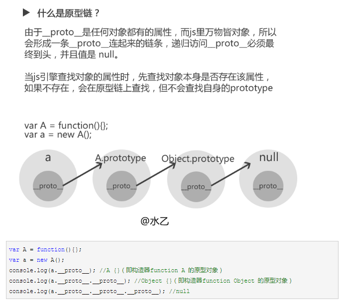

#### 什么是作用域链
作用域链是保证对执行环境有权访问的所有变量和函数的有序访问。
**在一个变量环境中只能访问他自己的环境和父执行环境**
链接：http://www.cnblogs.com/dirkhe/p/6031426.html

#### 清除浮动的几种方法
> 浮动产生的影响：如果父级不设置高度，背景图不会展示，边框不展示，margin设置的值不能正确显示
  处理：1、增加空div设置样式clear:both;
  2、跟1类似，用伪类::after{clear:both}
  3、设置父级元素：overflow:auto;

#### localstorage(5M)存储不够用怎么办
> 可以设置多个localstorage来保存大批量的数据

#### background-size必须放在background后面，否则无效

#### splice/slice
> splice：删除数组中index  a到b的数组，并影响原数组。
  slice：复制数组中a到b的数组，返回一个这个新的数组，原数组不影响。

#### getBoundingClientRect()
> Element.getBoundingClientRect()方法返回元素的大小及其相对于视口的位置。

#### get()
> const width = get(this.container.getBoundingClientRect(), 'width');  取到元素大小及其相对于视口位置中的width的值

#### <hr>
> 被水平线分隔的标题和段落

#### 当时间不是字符串格式不会被解析
> 必须是字符串格式才能被解析

#### a href="javascript:void(0);
> 可以防止不必要的页面跳动

#### 数组和对象是引用类型

#### |(按位运算符)和||
> 在js中只有&&和|| 不存在|，但是js中如果使用|还是能正常使用，如果给数字赋值，当金额达到13亿或者以上的时候，会出现赋值不正确的情况，与正确的值相差非常大 var a  =  13亿以上 | 0，a显示的不是正确值

#### 按位运算符
> 按位运算符
        & 运算符
  &是二元运算符，它以特定的方式的方式组合操作数中对应的位 如果对应的位都为1，那么结果就是1， 如果任意一个位是0 则结果就是0
  1 & 3的结果为1
  来看看它的怎么运行的：
  1的二进制表示为 0 0 0 0 0 0 1
  3的二进制表示为 0 0 0 0 0 1 1
  根据 & 的规则 得到的结果为 0 0 0 0 0 0 0 1,十进制表示就是1
  只要任何一位是0 &运算的结果就是 0，所以可以用&把某个变量不必要的位设为0, 比如某个变量的二进制表示为 0 1 0 0 1 0 0 1, 我想保留低4位，消除高4位 用 & 0x0F就可以了（住：0x0F为16进制表示法，对应的二进制为 0 0 0 0 1 1 1 1），这个特性有个很重要的应用，在后面会提到。
       | 运算符
  | 跟 & 的区别在于 如果对应的位中任一个操作数为1 那么结果就是1
  1 | 3 的结果为3   详见 -- >http://www.jb51.net/article/46473.htm

  js按位运算符|取整
  > var  num = m | 0;可以取到m的整数部分，但是会出现m值过大，导致num值变成负数的情况。所以这边用parseInt更好

#### 如何在js中导入某个方法中的方法
> func().func();  前面的func必须加()

#### a.toFixed(2) a是0
> a.toFixed(2)会对0报错 undeined

#### 屏幕卷去的高度：
window.scrollY

#### 屏幕卷去的宽度：
window.scrollX

#### 取一个元素的高度：
 elem.offsetHeight

#### 如何实现页面到底自动刷新：
```javascript
if ((2 * H + T) > eH) {
            t.dataLoadFinish = false;
            t.getNewsList(t.page, t.lastTime);
          }
然后再给window监听就好
详见news.vue的scroll()方法
```
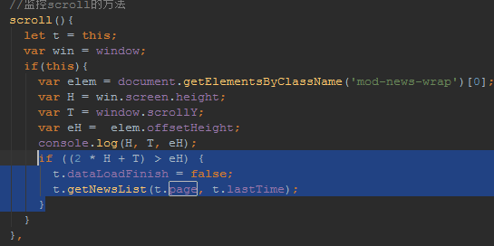

#### 获取元素卷去的高度：
> elem.scrollTop

#### 如何用js获取各种高度宽度
```javascript
网页可见区域宽： document.body.clientWidth
网页可见区域高： document.body.clientHeight
网页可见区域宽： document.body.offsetWidth (包括边线的宽)
网页可见区域高： document.body.offsetHeight (包括边线的高)
网页正文全文宽： document.body.scrollWidth
网页正文全文高： document.body.scrollHeight
网页被卷去的高： document.body.scrollTop
网页被卷去的左： document.body.scrollLeft
网页正文部分上： window.screenTop
网页正文部分左： window.screenLeft
屏幕分辨率的高： window.screen.height
屏幕分辨率的宽： window.screen.width
屏幕可用工作区高度： window.screen.availHeight
屏幕可用工作区宽度： window.screen.availWidth
```

#### angular的$window和window等同

#### 方法调用导致方法内变量失效问题
> 引用一个方法，初始化的时候运行一下，之后不必再运行，再运行就是再次初始化，之后要用到里面的变量会被抹去
  详见tradesell.vue页面
  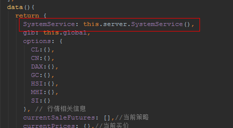
  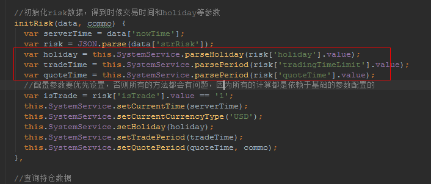

#### js实现jquery一些方法
详见 -- http://www.cnblogs.com/coco1s/p/4484238.html

#### 如何实现jq的一些css方法
> 善用classList
  增添样式： el.classList.add("someClass");
  删除样式： el.classList.remove("someClass");
  判断是否有样式： if(el.classList.contains("someClass"))
  设置样式： el.style.height = '100px'等等

#### createdocumentfragment()
> 方法创建了一虚拟的节点对象，节点对象包含所有属性和方法。
  当你想提取文档的一部分，改变，增加，或删除某些内容及插入到文档末尾可以使用createDocumentFragment() 方法。
  你也可以使用文档的文档对象来执行这些变化，但要防止文件结构被破坏，createDocumentFragment() 方法可以更安全改变文档的结构及节点

#### shift()
> 方法用于把数组的第一个元素从其中删除，并返回第一个元素的值。

#### 多个input表单提交
> 动态提交多个input的name和value，在遍历中插入input元素，并给input设置value和name，根据需求设置type是否为hidden

#### js创建dom节点方式
> 不能以字符串的形势然后append来插入，这是jq的写法，js： document.creatElement("input")；document.creatNodeText("啦啦啦")，然后设置dom元素的属性

#### 如何删除字符串最后一个字符
> 1：str = str.substr(0, str.length - 1)
  2：str = str.substring(0, str.length - 1);
  3: str = str.substring(0,str.lastIndexOf("最后一个元素"))

#### 数组怎么删除最后一个元素
> arr.pop()

#### 数组怎么删除第一个元素
> arr.shift()

#### 数组排序
> sort()

#### 编码
> escape()函数:该方法不会对 ASCII 字母和数字进行编码，也不会对下面这些 ASCII 标点符号进行编码： - _ . ! ~ * ' ( ) 。其他所有的字符都会被转义序列替换。
  encodeURI()函数:该方法不会对 ASCII 字母和数字进行编码，也不会对这些 ASCII 标点符号进行编码： - _ . ! ~ * ' ( ) 。encodeURI() 函数是不会进行转义的：;/?:@&=+$,#
  encodeURIComponent() 函数:可把字符串作为 URI 组件进行编码。该方法不会对 ASCII 字母和数字进行编码，也不会对这些 ASCII 标点符号进行编码： - _ . ! ~ * ' ( ) 。
  其他字符（比如 ：;/?:@&=+$,# 这些用于分隔 URI 组件的标点符号），都是由一个或多个十六进制的转义序列替换的。
  提示和注释
  提示：请注意 encodeURIComponent() 函数 与 encodeURI() 函数的区别之处，前者假定它的参数是 URI 的一部分（比如协议、主机名、路径或查询字符串）。因此 encodeURIComponent() 函数将转义用于分隔 URI 各个部分的标点符号。

#### 转换成二进制
> a.toString(2)

#### js无法修改的请求头参数
> origin，host，referrer

#### 如果摸个元素需要相对于父元素决定定位，父元素必须不是static

#### 相对定位导致显示模糊
> 在chrome浏览器中，元素若相对定位，钙元素显示会模糊，手机上没问题
  看图 -->  微策略3.6版本
  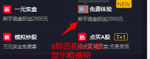
  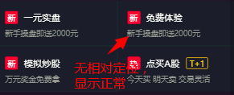

#### 设置cookie
> document.cookie = "name=" + value
  每个cookie值得name/value用分号和空格分开 --> ";  "
  cookie的有效期跟浏览器的进程同步（浏览器关闭），而不是浏览器单个窗口关闭
  如果设置cookie的路径为"/"那么和localstorage有相同的作用域
  用document.cookie可以取到当前文档的cookie值，但是取不到其他设置的cookie，所以这也是为什么我在控制套打印的时候取不到ycl.yztz.cn的JSSENSIONID的原因
  要把name/value取出来还要解码。decodeURIComponent() -- 编码：encodeURIComponent();解码出来后用JSON.parse()解析成json对象

#### cookie内存
> 4KB

#### localstorage内存
> 5MB

#### sessionstorage内存
> 无详细说明

#### eval()
> JS函数，可以计算string类型的加减乘除，能运行字符串类型的js函数

#### location
> 表示当前该窗口中当前显示的文档的URL
  window.location === docuemnt.location;   true
  location.toString() -- 返回当前当前的href属性的值

#### 数组的toString()方法
> 详见 -- 犀牛书P155  [1,2,3] --> "1,2,3"; ["1","2","3"] --> "1,2,3" ; [1,[2,3]] --> "1,2,3"

#### 数组方法
> new Array( 5) 长度为5 五个undefined === [  , , , , ]

#### unshift / shift
> unshift 在数组的头部增添元素 ， shift 删除数组的头部元素。 与push / pop相反

#### 如何创建一个不继承任何方法的对象
> var a = Object.creat(null);这种方式一般情况下不会用到，没有任何的基础方法，比如toString，甚至不能和 + 运算符工作

#### Object.creat()
> 参数就是对象的原型，例如var a = Object({x : 1}); a对象的原型就是{x :1}; 如果要创建一个普通的对象：Object.creat(Object.prototype)

#### new Date()参数设置
> new Date(year, month, day, hour, minute, second, millisecond);

#### sessionStorage
> 项目需求，王者期货IOS无法上线到apple store，要内嵌我H5所有页面，我根据他的source来index页面的下载模块的抹去，由于全部用的我的页面，跳转到其他页面再跳转到首页的话，下载模块也要去掉，所以把hideDownload设置到sessionStorage里，页面关闭后也不影响我自己的H5页面

#### QQ浏览器的img标签问题
> img的高度设置比外框div高1px就行（后来又特么没这问题了，妈的）
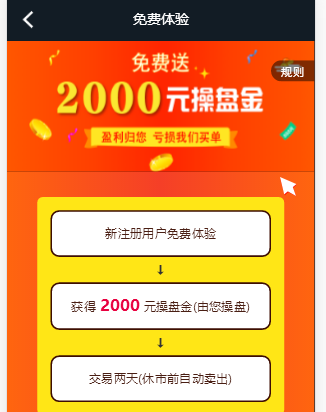

#### 安卓webview问题解决屏幕适配问题，撑开整个页面
> 安卓（小米）手机屏幕过大时，未登录免费体验进入时正常显示，跳转登陆后再进入免费体现，由于屏幕高度过高，底部会有黑条；解决：用定时器多次设置高度，当高度等于屏幕该显示的高度时关闭。
  但是调试过程中，第二次进入的时候高度都是存在的，怀疑是CSS的问题，时间有限，先不考虑这个问题，用定时器解决

#### clipboard.min.js插件在移动端兼容的问题！
> 复制按钮，在wap端可以不受限制的复制粘贴，在移动端，必须用button标签 用span,a都不成

#### 免费体验页面兼容性问题
> 当页面不满足撑开整个页面，显示整个页面，并不能滑动。这时候，安卓内嵌H5的页面会出现黑条（小屏幕底部），大屏幕正常（document.body.offsetHeight）；用window.screen.height来控制的话，ios和android的头部条高度不同，所以不用它。用document.body.clientHeight来处理，各个浏览器都正常。
  浏览器端因为头部自带高度。这个不好控制，所以只能设置：浏览器打开的页面能滑动

#### 使用display:table-cell让大小不固定元素垂直居中已经是很老的方法了

#### 如何设置能禁止浏览器自动保存表单信息
> 链接： http://www.jb51.net/article/35878.htm

浏览器根据input标签的type来显示是否保存密码   <input type="text" name="password" onfocus="this.type='password'" />

#### cookie设置secure
> 只会在SSL协议下才能传输

#### expires
> cookie何时被删除，想要直接删除，把这个时间写成过去的就好了

#### WebViewJavascriptBridge使用问题
> 详细看xingu1.1项目的登录controller内容。
  该方法使用注意： 必写代码 -- >
  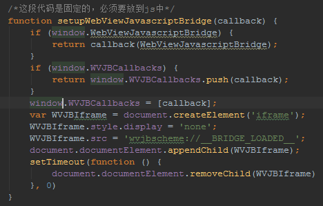
   bridge.callHandler和bridge.registerHandler必须写在setupWebViewJavascriptBridge函数体内；且这两个函数不能分开写，setupWebViewJavascriptBridge不能写多次；如果有异步函数，异步必须写在registerHandler内，responseCallback(data)必须写在异步内；这样调用能成功；当然，该异步方法在原生H5也是要用到的，所以在setupWebViewJavascriptBridge外也要有一个一模一样的异步函数再写一遍，setupWebViewJavascriptBridge内的异步只会在window对象内有window.WebViewJavascriptBridge才会执行。所以这并不冲突

   更新：
> 该插件的注册方法只能执行一次，无论是注册不同的方法名还是用变量接住responseCallback这个变量在异步中使用该变量都不行，无法用它来自动登录

#### 修复H5兼容IOS端，切换账号后还是自动登录旧账号的问题
> 在logout方法里设置一个localStorage一个字段： logOut为true(这个true为string格式)；在login页面判断IOS端传入的方法内，判断logOut是否为true，如果是true，则设置reaponseData 为 null；这就不会自动登录

#### 自动登录解决
> 当source=IOSAPP时，早localstorage存储密码，具体看xgH5-v1.1代码，在indexCtrl中判断是否手机，是手机判断localstorage中有无userInfo，提取用户名和密码并请求登录接口。在logout方法中，将localstorage的userInfo清除。

#### 渠道号问题
> 由于代码先运行service.js再运行app.js再运行controller.js，所以在ctrl中设置本地缓存，再让service.js去读取，必须刷新一次才能获取到，所以要把设置缓存的代码写在service.js内，看图
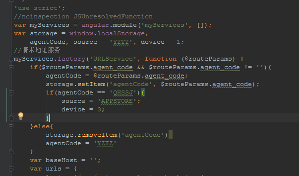
  这样，所有的agentCode和source可以在第一时间获取并设置，IOS端也可以完美兼容。

#### $location.url/$location.path()
> path: 对跳转的路径进行encode加密， url不会， 如果跳转的路径才有?参数，最好不要加密。除非包含秘密信息

#### 绝对定位的点击事件失效原因
> 由于width:100%所有left：0不写的话跟写是一样的，在浏览器模拟器中，点击没问题，但是手机中失效，原因是left：0没有写。a标签的href事件和ng-click事件都失效。所以，在绝对定位的元素中使用点击事件的话，必须将left,top等等中的两个必须写齐了。

#### 首页banner和pop配置参数
> 活动ID，活动名称，类型（banner0，弹窗1），图片地址，移动端跳转地址，H5端跳转地址

#### 数字处理
> 详见 -- http://www.css88.com/archives/8488#more-8488
  按位处理： number | 0，可以取到数字的整数部分，但是当该数字大于 2^31 -1时，会出错（21亿多）
  Math.round : 四舍五入
  Math.floor： 向下取整
  Math.ceil: 向上取整
  Math.trunc： 与parseInt()类似，但是internet explorer不支持

#### grid布局
> display: grid;
  grid-template-columns: 100px(列宽) 100px 100px;(3列)
  grid-templat-row: 50px(行高) 50px;(2行)  具体例子看： http://www.css88.com/archives/8506
  grid-column-start: 1;
  grid-column-end: 4;  /*网格线1开始，4结束，三个网格，4个线*/  ===  grid-column: 1 / 4;
  grid-row-start / grid-row-end  同理，跨行
  扩展： http://www.css88.com/archives/8512#more-8512
  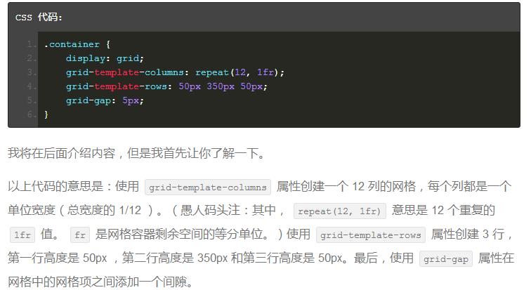

#### grid-template-areas
> 属性被称为网格区域，也叫模板区域

####  cursor:pointer;
> 悬浮手指

#### 定位元素优先级问题
> 当有元素margin设置成负值来造成视觉上的覆盖，普通的布局，后者会覆盖前者。当有定位元素时，定位优先级高于普通布局，这时用定位，再设置z-index即可(z-index只能用于定位元素)

#### border-radius问题
> 父级元素设置才有用，子元素设置没用。只设置一个角落可以：border-top/bottom-right/left-radius: **px设置
  也可以：border-radiu: * * * *;
  内部元素和外部元素同事有相同大小的border-radius时，内部边界与外元素内边界会有很小的空隙 看图 -- >
  解决： 内部元素的border-radius设置比外部元素小1px即可，具体看情况而定。也可以是>= 2px
  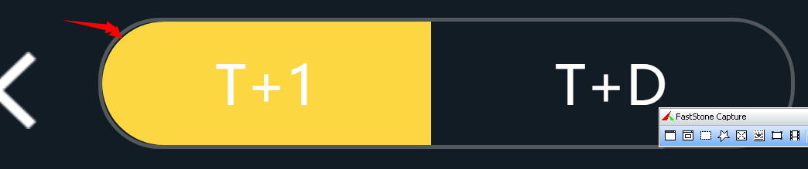

#### 文本溢出用...替代
```javascript
 text-overflow:ellipsis;
```

#### xhr.abort()
> 取消异步请求 -- 红皮书 p585

#### URL带参数查询服务器
> 必须用encodeURIComponent()对参数名和参数值进行编码，多个参数用&拼接

#### FromData()
> 红皮书 -- P578

#### table-cell
> 对ul  table后，再对li  table-cell后，再对li的宽度进行设置，可以保证因为li内内容长度不同，还能对齐
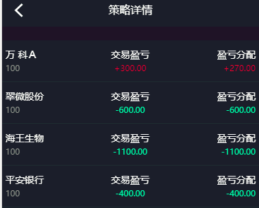

#### 框架和库的区别
> 框架也算是库的一种，但倾向于重量级一些，倾向于提供整套的解决方案，倾向于创造一些需要你来遵守的规则和范例。
  比如 AngularJS 就算是一个框架，因为它提供了一整套的解决方案，需要你按照它设计好的方式来写代码。而 jQuery 的分类则比较模糊一些，可以说是库，也可以说是框架。
  Framworks call you !  You call libraries!  区别在于控制权的问题。 框架是库的集合
   https://zhuanlan.zhihu.com/p/26078359?group_id=830801800406917120

#### Object.assign()
> Object.assign 将参数中的所有对象属性和值 合并到第一个参数 并返回合并后的对象
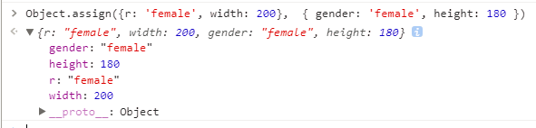

#### HTML5.2 - dialog元素
> 默认绝对定位，block， width默认为100%，内边距默认16px， border默认3px； 默认居中；可以设置
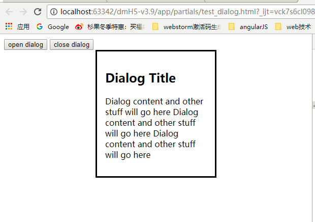

#### 支持iframe支付
http://mp.weixin.qq.com/s?__biz=MjM5MTA1MjAxMQ==&mid=2651227645&idx=1&sn=64ebca98ff7b26b2fb4cf858b4154d26&chksm=bd495c798a3ed56ff8fcca8e3a154f9dbb0bdf6a182c5e9b1452efb7d561ada1f465e0b13eb8&mpshare=1&scene=23&srcid=0118wDCr2N6YogFa5PrkqYr9#rd    --   5.2更新的知识点
<iframe allowpaymentrequest>语法

#### 图标尺寸 -- sizes
> <link rel="icon" sizes="16x16" href="path/to/icon16.png">
  <link rel="icon" sizes="32x32" href="path/to/icon32.png">
  在 HTML 5.2 之前，sizes 属性仅能用于 rel 为 icon 的 link 元素中。然而，苹果的 iOS 设备不支持 sizes 属性。为了解决这个问题，苹果自己引入了一个他们设备专用的 rel appple-touch-icon 用于定义他们设备上使用的图标。上知识点的链接可看

#### URL / URI
> 统一资源标志符URI就是在某一规则下能把一个资源独一无二地标识出来。拿人做例子，假设这个世界上所有人的名字都不能重复，那么名字就是URI的一个实例，通过名字这个字符串就可以标识出唯一的一个人。现实当中名字当然是会重复的，所以身份证号才是URI，通过身份证号能让我们能且仅能确定一个人。那统一资源定位符URL是什么呢。也拿人做例子然后跟HTTP的URL做类比，就可以有：动物住址协议://地球/中国/浙江省/杭州市/西湖区/某大学/14号宿舍楼/525号寝/张三.人可以看到，这个字符串同样标识出了唯一的一个人，起到了URI的作用，所以URL是URI的子集。URL是以描述人的位置来唯一确定一个人的。在上文我们用身份证号也可以唯一确定一个人。对于这个在杭州的张三，我们也可以用：身份证号：123456789来标识他。所以不论是用定位的方式还是用编号的方式，我们都可以唯一确定一个人，都是URl的一种实现，而URL就是用定位的方式实现的URI。回到Web上，假设所有的Html文档都有唯一的编号，记作html:xxxxx，xxxxx是一串数字，即Html文档的身份证号码，这个能唯一标识一个Html文档，那么这个号码就是一个URI。而URL则通过描述是哪个主机上哪个路径上的文件来唯一确定一个资源，也就是定位的方式来实现的URI。对于现在网址我更倾向于叫它URL，毕竟它提供了资源的位置信息，如果有一天网址通过号码来标识变成了http://741236985.html，那感觉叫成URI更为合适，不过这样子的话还得想办法找到这个资源咯…

#### img标签和div标签的空白
> 将img设置成block


#### CSS外边距合并：子元素的margin-top外边距被作用在父元素
> https://www.iyaxi.com/2016-11-17/1147.html
  父元素设置padding-top: 1px或者设置border-top

#### 策略动态不显示的问题
> 在首页index.html页面，由于切换tab页面才显示动态和榜单，所以将tab-content>div设置成display: none；当当前样式为act-cpdr或者con-clph时设置成block，所以导致在T+1和其他页面做组件的时候导致有数据都不显示(拷贝的代码没有仔细检查，有数据不显示首先检查css问题)。实际证明，angular自定义指令可以获取异步数据
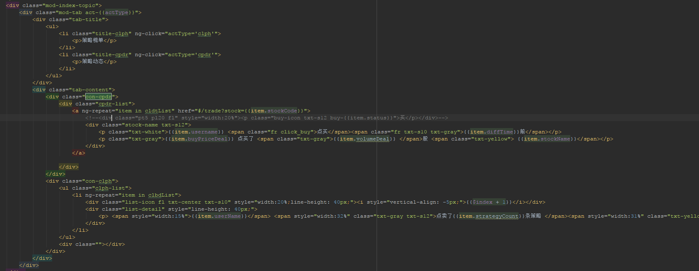
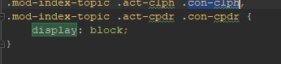
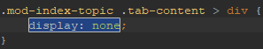

#### 被兄弟元素子元素浮动导致布局异常
> 被影响的元素： clear: both;

#### line-height 问题
> 当子元素都是浮动元素，默认高度为0，因为浮动已经脱离布局。所以必有有一个元素在流布局中，或者设置高度（一般默认左边显示的不用设置左浮动）

#### table属性
> cellspacing: 单元格之间的空隙，cellpadding: 单元格边框和内容的距离，不用带'px'
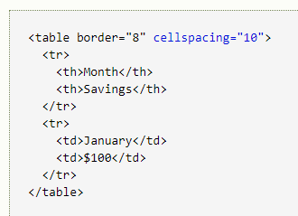

#### 如何在inline-block中的子元素撑满父元素
> 子元素设置block,不要设置高度和width:100%;很容易出错

#### a标签内子元素点击触发a标签跳转的解决方法
> 1、将子元素移出a标签，绝对定位到a标签上。这可避免
  2、阻止事件的冒泡行为 :e.stopPropagation();  e.preventDefault();  angular点击事件： $event

#### json文件无法注释
> json文件本身不支持注释】


#### Object.observe
> JS原生绑定DOM用的，chrome已经被移除，原生绑定用get/set

#### px，em，rem 的区别
> px 像素(Pixel)。绝对单位。像素 px 是相对于显示器屏幕分辨率而言的，是一个虚拟长度单位，是计算 机系统的数字化图像长度单位，如果 px 要换算成物理长度，需要指定精度 DPI。
  em 是相对长度单位，相对于当前对象内文本的字体尺寸。如当前对行内文本的字体尺寸未被人为设置， 则相对于浏览器的默认字体尺寸。它会继承父级元素的字体大小，因此并不是一个固定的值。
  rem 是 CSS3 新增的一个相对单位(root em，根 em)，使用 rem 为元素设定字体大小时，仍然是相对大小， 但相对的只是 HTML 根元素。