#### 独立构建
> 独立构建包含模板编译器并支持 template 选项。 它也依赖于浏览器的接口的存在，所以你不能使用它来为服务器端渲染。
#### 运行构建
> 运行时构建不包含模板编译器，因此不支持 template 选项，只能用 render 选项，但即使使用运行时构建，在单文件组件中也依然可以写模板，因为单文件组件的模板会在构建时预编译为 render 函数。运行时构建比独立构建要轻量30%，只有 17.14 Kb min+gzip大小。
##### Vue构造器
> 每个 Vue 实例都会代理其 data 对象里所有的属性。注意只有这些被代理的属性是响应的。如果在实例创建之后添加新的属性到实例上，它不会触发视图更新。
   Vue 实例暴露了一些有用的实例属性与方法。这些属性与方法都有前缀 $，以便与代理的 data 属性区分

#### =>箭头函数问题
> 不要在实例属性或者回调函数中（如 vm.$watch('a', newVal => this.myMethod())）使用箭头函数。因为箭头函数绑定父上下文，所以 this 不会像预想的一样是 Vue 实例，而是 this.myMethod 未被定义。

#### v-on / v-bind缩写
```
v-on:click="donsonthing"  -> @click="dosonthing"      v-bind:href="url"  ->  :href="url"
```
#### v-once指令
> 只会跟数据绑定一次，之后数据变化，页面不会更新

#### "双大括号"不能再html属性中试用
> 试用v-bind:id="id"

#### "双大括号"中可以试用js
```
{{string.split(';');}}等等   if**{**}不能使用，试用三目  只能试用表达式不能试用语句:{{var a = 1}}
```

#### v-html
> 输出纯html  被插入的内容都会被当做 HTML —— 数据绑定会被忽略。 不能使用 v-html 来复合局部模板

#### v-on
> v-on 指令，它用于监听 DOM 事件     可缩写成@    @click = "doSomeThing"

#### v-bind
> v-bind 指令被用来响应地更新 HTML 属性      可缩写成:  :href = ""

#### 计算属性  VS  method
> 计算属性是基于它们的依赖进行缓存的。计算属性只有在它的相关依赖发生改变时才会重新求值。这就意味着只要 message 还没有发生改变，多次访问 reversedMessage 计算属性会立即返回之前的计算结果，而不必再次执行函数。相比而言，只要发生重新渲染，method 调用总会执行该函数。
  我们为什么需要缓存？假设我们有一个性能开销比较大的的计算属性 A ，它需要遍历一个极大的数组和做大量的计算。然后我们可能有其他的计算属性依赖于 A 。如果没有缓存，我们将不可避免的多次执行 A 的 getter！如果你不希望有缓存，请用 method 替代

#### watch -- vue
> 虽然计算属性在大多数情况下更合适，但有时也需要一个自定义的 watcher 。这是为什么 Vue 提供一个更通用的方法通过 watch 选项，来响应数据的变化。当你想要在数据变化响应时，执行异步操作或开销较大的操作，这是很有用的。

##### _.debounce -- lodash.min.js
> _.debounce 是一个通过 lodash 限制操作频率的函数  ,   ajax请求直到用户输入完毕才会发出

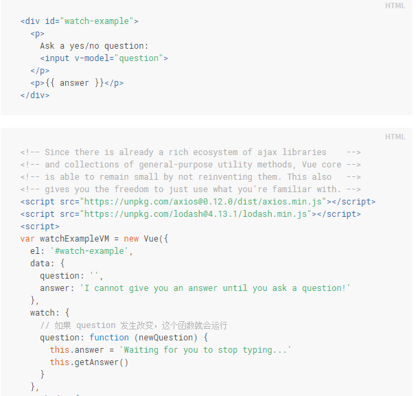
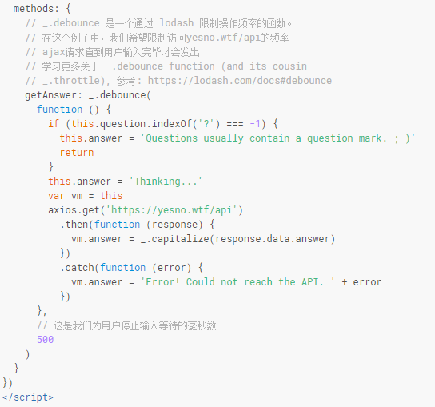

#### v-bind=class:"{}"
> v-bind:class="{active ： isactive}"   要用对象形势包裹   如果是对象则可省去{}  , 也可以直接绑定计算属性 ， 也可以直接绑定数组，数组内还可以用三元表达式，还可在数组中写对象语法

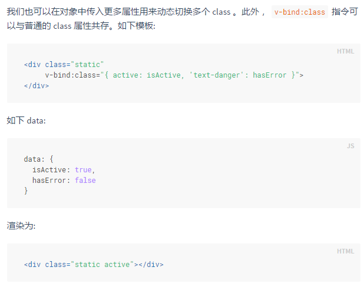
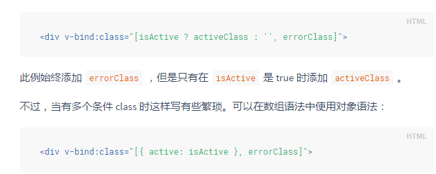

#### v-bind=style:"{}"
> v-bind:style 的对象语法十分直观——看着非常像 CSS ，其实它是一个 JavaScript 对象。
  <div v-bind:style="{ color: activeColor, fontSize: fontSize + 'px' }"></div>
  也可以直接使用对象，跟class类似'
  也可以用数组语法，跟class类似
  自动加前缀：当 v-bind:style 使用需要特定前缀的 CSS 属性时，如 transform ，Vue.js 会自动侦测并添加相应的前缀。
  可以给标签添加一个属性，例如：v-bind:_src={{item.productimage}}
  在vue2.0中，图片绑定不可以写成src={{item.image}},而要写成v-bind:src={{item.image}}

#### template
> 是一种用于保存客户端内容的机制，该内容在页面加载时不被渲染，但可以在运行时使用JavaScript进行实例化。
  可以将一个模板视为正在被存储以供随后在文档中使用的一个内容片段。
  虽然, 在加载页面的同时,解析器确实处理 template元素的内容，这样做只是确保这些内容是有效的; 然而,元素的内容不会被渲染。
  该元素没有childNode的概念，只有content概念，可将其content克隆出来

#### v-if / v-else / v-else-if
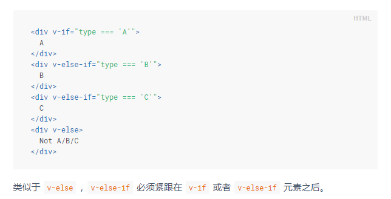
> v-else 元素必须紧跟在 v-if 或者 v-else-if 元素的后面——否则它将不会被识别。
  v-else-if，顾名思义，充当 v-if 的“else-if 块”。可以链式地使用多次
  v-for 跟v-if一起使用的时候，v-for 有更高的优先级


#### 当利用索引直接设置一个项的注意事项
> 当你利用索引直接设置一个项时，例如： vm.items[indexOfItem] = newValue
  当你修改数组的长度时，例如： vm.items.length = newLength    都不会生效解决办法看图
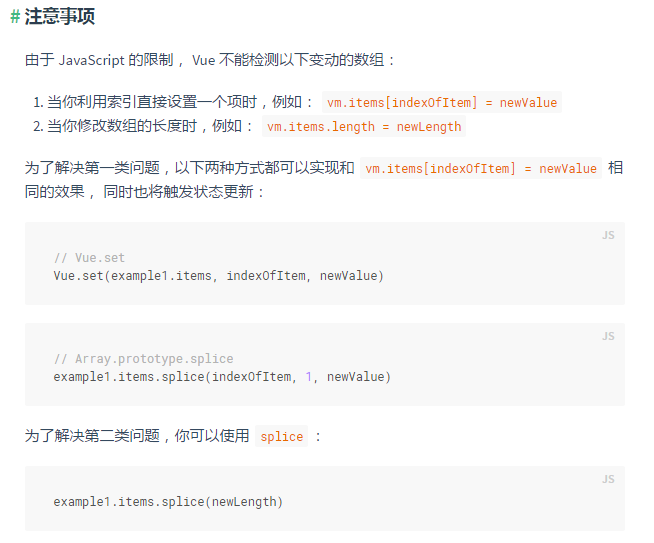

#### DOM原生事件
> 用$event导入

#### v-on修饰符
> 在事件处理程序中调用 event.preventDefault() 或 event.stopPropagation() 是非常常见的需求。尽管我们可以在 methods 中轻松实现这点，但更好的方式是：methods 只有纯粹的数据逻辑，而不是去处理 DOM 事件细节。

  点击事件将只会触发一次
  ```javascript
  <a v-on:click.once="doThis"></a>
  ```
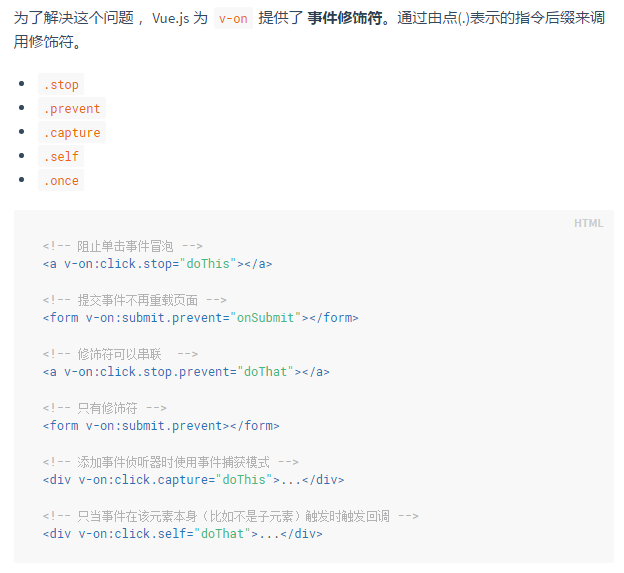

#### is属性
```javascript
元素 <ul>，<ol>，<table>，<select> 限制了能被它包裹的元素，而一些像 <option> 这样的元素只能出现在某些其它元素内部
```
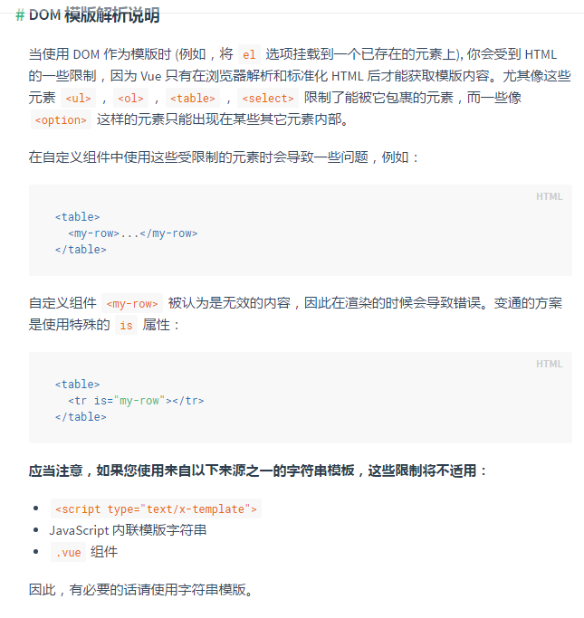

#### 父子组建通信(props，父子组件)
> 通过子组件props  详细看重构策略宝项目代码
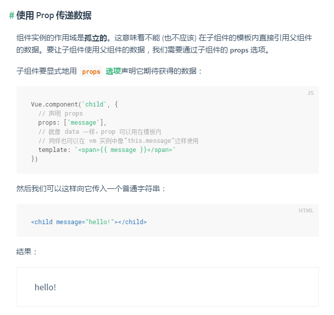
##### props
> 父子组建之间数据通信单向数据流 。  组件实例的作用域是孤立的。这意味着不能 (也不应该) 在子组件的模板内直接引用父组件的数据。要让子组件使用父组件的数据，我们需要通过子组件的 props 选项。
##### props验证
> 我们可以为组件的 props 指定验证规格。如果传入的数据不符合规格，Vue 会发出警告，要指定验证规格，需要用对象的形式，而不能用字符串数组
##### 自定义事件
> 父组件是使用 props 传递数据给子组件，但如果子组件要把数据传递回去，用自定义事件。
  使用 $on(eventName) 监听事件
  使用 $emit(eventName) 触发事件
  不能用 $on 侦听子组件抛出的事件，而必须在模板里直接用 v-on 绑定，就像以下的例子：
  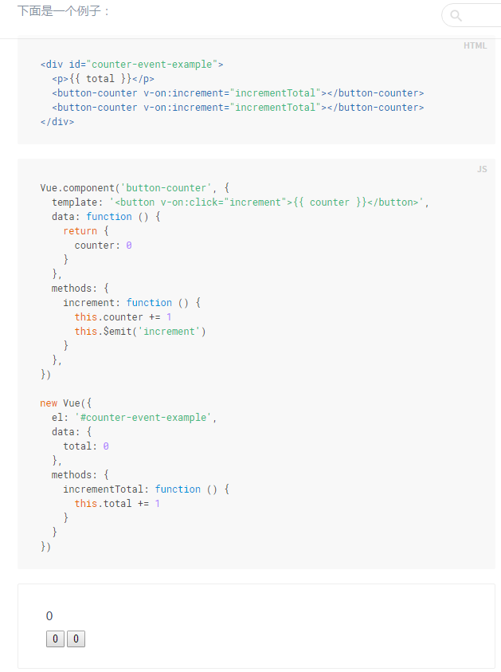
  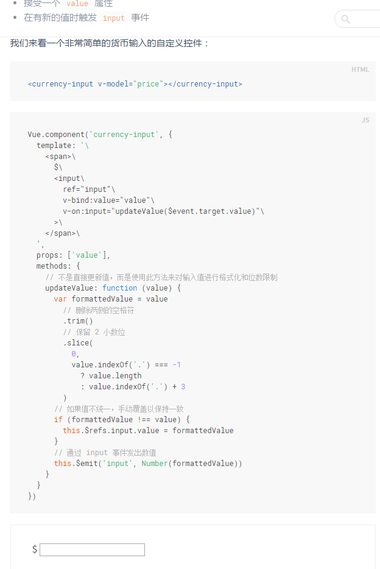

##### 编译作用域
> 父组件模板的内容在父组件作用域内编译；子组件模板的内容在子组件作用域内编译
https://github.com/wuhencut/vue-clb


##### slot
> 除非子组件模板包含至少一个 <slot> 插口，否则父组件的内容将会被丢弃。当子组件模板只有一个没有属性的 slot 时，父组件整个内容片段将插入到 slot 所在的 DOM 位置，并替换掉 slot 标签本身。
  具体看vue.js组件部分的slot
  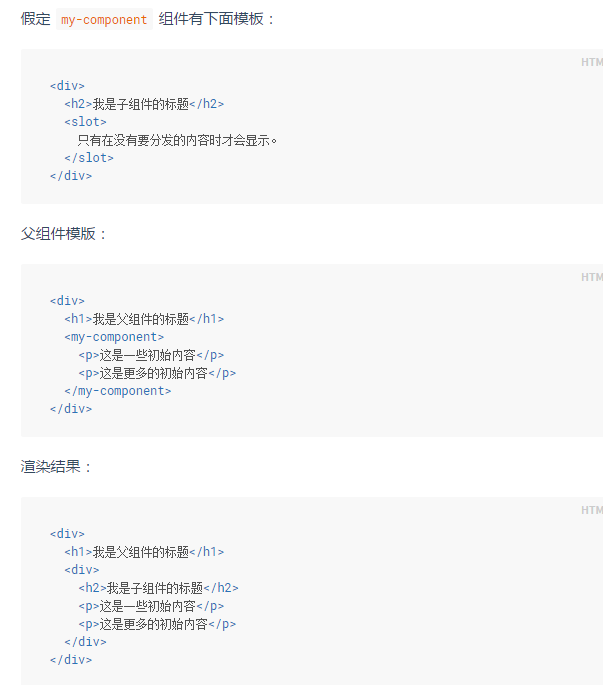

###### slots
> 可以从this.$slots获取VNodes列表中的静态内容:

#### DOM模板 和 字符串模板
> dom模板就是原先就写在页面上的，能被浏览器识别的 html 结构，会在一加载就被浏览器渲染，所以要遵循 html 结构和标签命名，不然是不会被浏览器解析的，也就获取不到内容了，接着js获取 dom 节点的内容，就形成了 dom 模板。
  字符串模板可能原先放在服务器上啊，script标签里，js 的字符串里，原先不参与页面渲染的一串字符，所以呢 它可以不在乎 html 结构和标签命名，只要你最后根据模板生成内容的结构和命名正确就好。
  这两者其实区别就在于第一次获取到的方式不同，dom 模板参与浏览器解析，而字符串模板不参与，所以 dom 写起来要规范，而字符串模板不用

#### 组件中的data必须是函数
当同一个模块内用多次用到同一个组件的时候，而且每个组件要单独控制的时候，data不能放在全局。单独放在component中
```javascript
data:function (){
    return {
        count : 0
    }
}
```
#### $set
> Vue.set       ..... Vue.set(vm.someObject, 'b',2)

#### Vue.nextTick(callback)
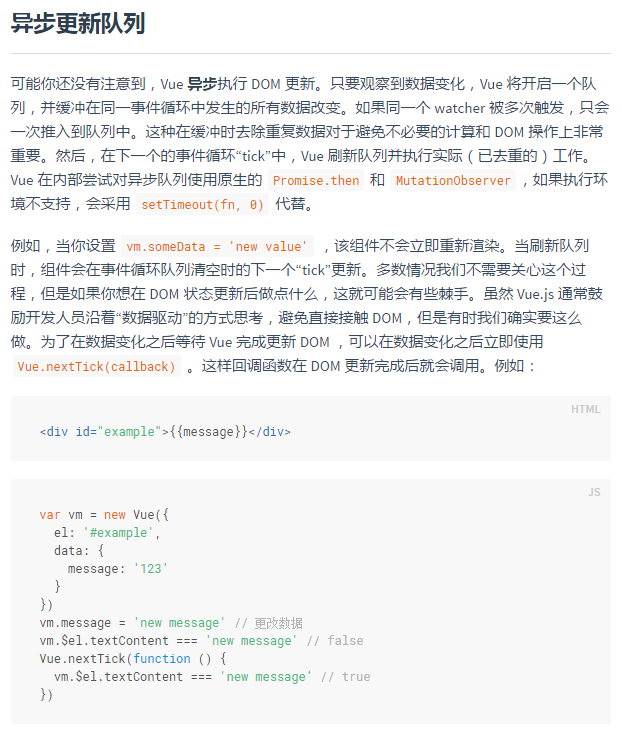
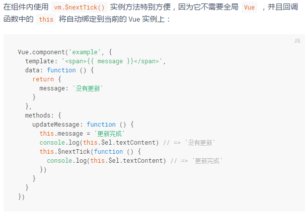

#### css 过渡类名
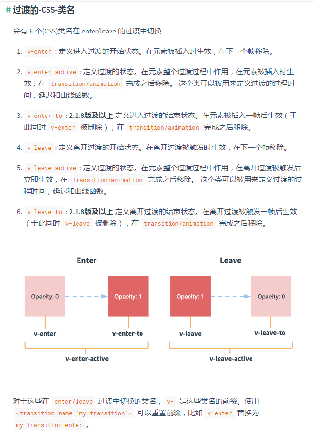

#### cubic-bezier
> 贝兹曲线中的绘制方法
  图上有四点，P0-3，其中P0、P3是默认的点，对应了[0,0], [1,1]。而剩下的P1、P2两点则是我们通过cubic-bezier()自定义的。cubic-bezier(x1, y1, x2, y2) 为自定义，x1,x2,y1,y2的值范围在[0, 1]。

#### 动画
>  具体使用看vue   css相关
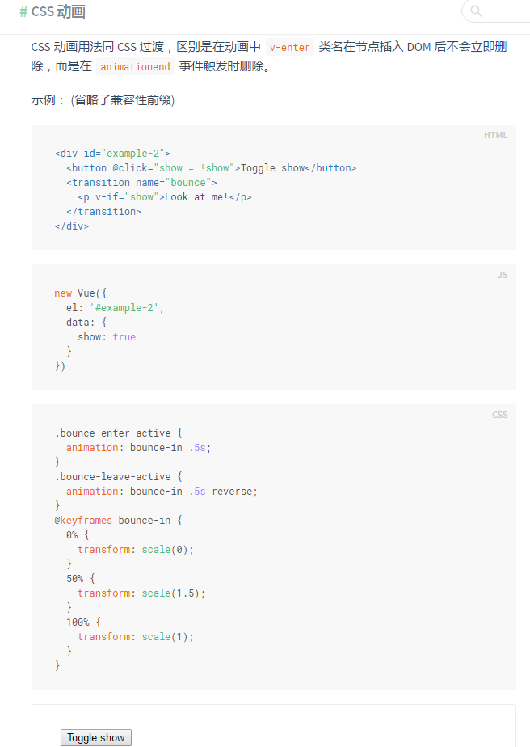

#### 过渡模式
> in-out: 新元素先进行过渡，完成之后当前元素过渡离开。
  out-in: 当前元素先进行过渡，完成之后新元素过渡进入。
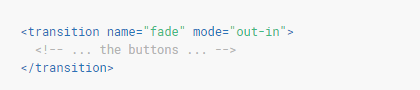

#### transition
> transition   :看文档

#### transition-group
 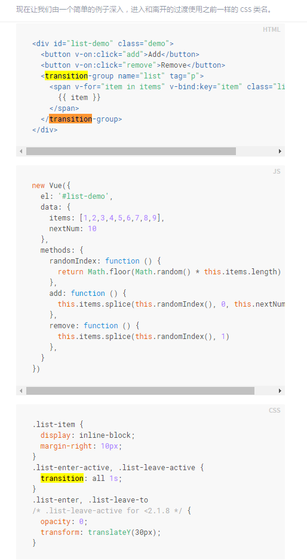
> v-move     ：<transition-group> 组件还有一个特殊之处。不仅可以进入和离开动画，还可以改变定位。要使用这个新功能只需了解新增的 v-move 特性，它会在元素的改变定位的过程中应用。像之前的类名一样，可以通过 name 属性来自定义前缀，也可以通过 move-class 属性手动设置。

  tag
   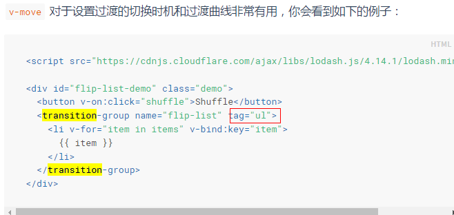

#### Vue.directive
> 除了默认设置的核心指令( v-model 和 v-show ),Vue 也允许注册自定义指令。注意，在 Vue2.0 里面，代码复用的主要形式和抽象是组件——然而，有的情况下,你仍然需要对纯 DOM 元素进行底层操作,这时候就会用到自定义指令

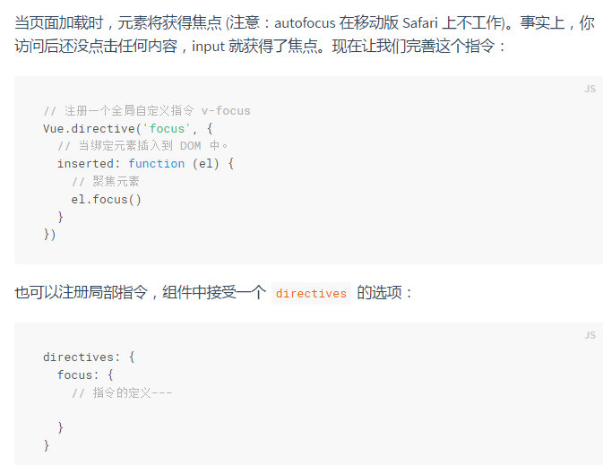
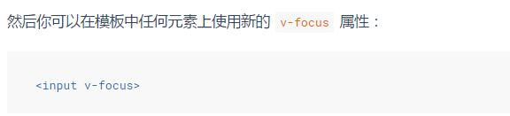

#### vue不同页面怎么传值
链接：http://blog.csdn.net/qq_32786873/article/details/70844811
> 一、this.$router.params.paramName / this.$router.query.paraName
  二、组件传值：
  this.$parent.$data.id  //获取父元素data中的id
  this.$children.$data.id  //获取子元素data中的id
  二、通过全局创建个vue实例 window.eventBus  = new Vue();
  在需要传递参数的组件中，定义一个emit发送需要传递的值，键名可以自己定义（可以为对象）
   eventBus.$emit('eventBusName', id);
  在需要接受参数的组件重，用on接受该值（或对象）
   //val即为传递过来的值
  eventBus.$on('eventBusName', function(val) {
  　console.log(val)
  })
  　最后记住要在beforeDestroy()中关闭这个eventBus
  eventBus.$off('eventBusName');
  四、通过localStorage或者sessionStorage来存储数据
  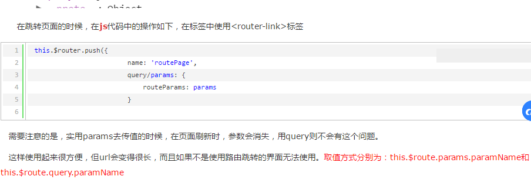

#### vue与angular的区别
> vue仅仅是mvvm中的view层，只是一个如jquery般的工具库，而不是框架，而angular而是mvvm框架。
  vue的双向邦定是基于ES5 中的 getter/setter来实现的，而angular而是由自己实现一套模版编译规则，需要进行所谓的“脏”检查，vue则不需要。因此，vue在性能上更高效，但是代价是对于ie9以下的浏览器无法支持。
  vue需要提供一个el对象进行实例化，后续的所有作用范围也是在el对象之下，而angular而是整个html页面。一个页面，可以有多个vue实例，而angular好像不是这么玩的。
  vue真的很容易上手，学习成本相对低，不过可以参考的资料不是很丰富，官方文档比较简单，缺少全面的使用案例。高级的用法，需要自己去研究源码，至少目前是这样。

#### 使用npm安装vue脚手架cli时出错的解决方法
> 现这个原因，主要是C盘写入权限不足，可以用管理员身份运行cmd命名（方法：通过目录找到‪C:\Windows\System32\cmd.exe，然后右键单击，出现选项，选择以管理员身份运行即可）

#### vue-resource
> 一个vue的异步请求的库，现在已经用axios取代它
  这个插件不像angular一样可以直接用res.data....该插件对返回的数据进行了一次封装，有body，bodytext等等，数据在body中，并不再第一层，所以正确取数据：res.body.data....

#### _this / this
> 在vue实例中，this是指向vm实例的，如果要调用在某个函数内部的this，那就要将vm实例的this赋值给_this，才可以在函数内部使用this，此时的this是指向函数，_this指向vm实例

#### v-for指令里可以嵌套v-for指令
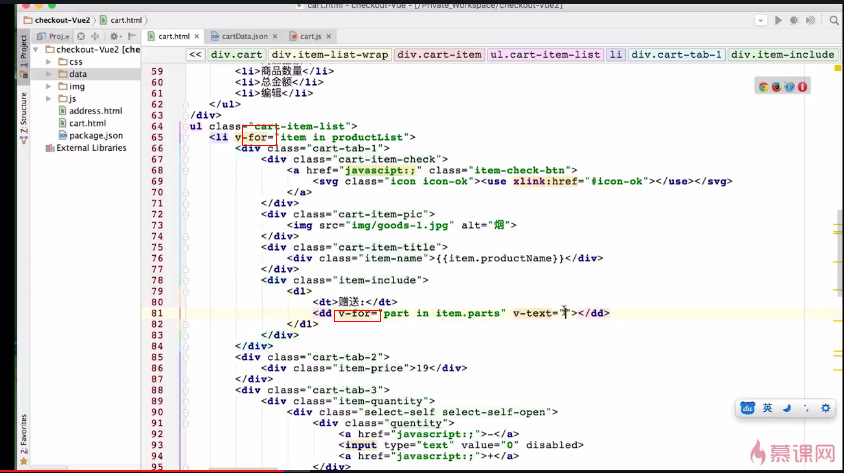
##### v-text = "item.text"
看上图中的绑定

#### vue的过滤器filters
> 当过滤器中要用到参数的话，要把参数当函数参数写在过滤器方法中
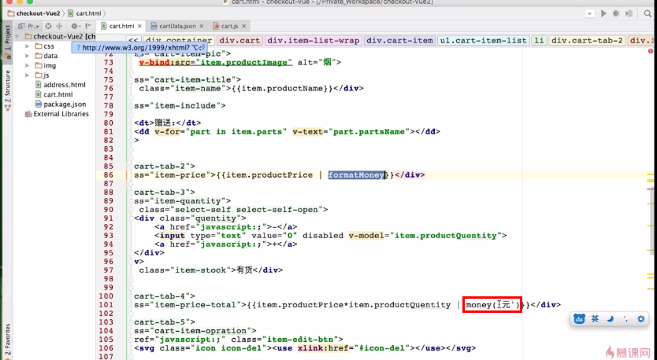

#### Vue.set()
> 如果我们获取的数据里面没有a变量，但是由于业务需求我们需要自己添加一个a变量来控制业务。那么，由于自己添加的a变量不会被vue监听，所以需要强行让vue监听来实现双向绑定，此时需要Vue.set()方法 ------这是全局注册，局部注册：this.$set(item,'a',值)

#### Vue.mixin()
> 全局注册一个混合，影响注册之后所有创建的每个 Vue 实例。插件作者可以使用混合，向组件注入自定义的行为。不推荐在应用代码中使用。

#### $delete只支持1.0版本
> this.$delete(),2.0版本建议使用原生js来进行删除，用index = indexOf(item)，然后list.splice(index,1);即可
  但是在官网API文档中，可以用Vue.delete(array ,index)的方式来删除的。这个后面再确认

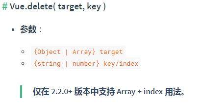

#### limitBy在2.0无用
> 用.splice()来替代

#### 在页面指令中写表达式注意！
> 不要在页面指令中写 this。  this.xxx =  this.listxxx   不用this，直接写就好

#### AMD和CMD的差别
> AMD：requireJS、CMD：seaJS(国内)
  AMD和CMD最大的区别是对依赖模块的执行时机处理不同，注意不是加载的时机或者方式不同
  很多人说requireJS是异步加载模块，SeaJS是同步加载模块，这么理解实际上是不准确的，其实加载模块都是异步的，只不过AMD依赖前置，js可以方便知道依赖模块是谁，立即加载，而CMD就近依赖，需要使用把模块变为字符串解析一遍才知道依赖了那些模块，这也是很多人诟病CMD的一点，牺牲性能来带来开发的便利性，实际上解析模块用的时间短到可以忽略
  为什么我们说两个的区别是依赖模块执行时机不同，为什么很多人认为ADM是异步的，CMD是同步的（除了名字的原因。。。）
  同样都是异步加载模块，AMD在加载模块完成后就会执行该模块，所有模块都加载执行完后会进入require的回调函数，执行主逻辑，这样的效果就是依赖模块的执行顺序和书写顺序不一定一致，看网络速度，哪个先下载下来，哪个先执行，但是主逻辑一定在所有依赖加载完成后才执行
  CMD加载完某个依赖模块后并不执行，只是下载而已，在所有依赖模块加载完成后进入主逻辑，遇到require语句的时候才执行对应的模块，这样模块的执行顺序和书写顺序是完全一致的
  这也是很多人说AMD用户体验好，因为没有延迟，依赖模块提前执行了，CMD性能好，因为只有用户需要的时候才执行的原因
  地址：http://blog.csdn.net/baidu_31333625/article/details/70160398

#### vendor.js
> webpack将项目依赖的第三方压缩成一个独立的包，并用hash值跟踪，当有内容变动的时候才会更新。

#### vue的跨域
```javascript
在config/index.js中修改proxyTable：
 dev: {
    env: require('./dev.env'),
    port: 8080,
    autoOpenBrowser: true,
    assetsSubDirectory: 'static',
    assetsPublicPath: '/',
    proxyTable: {},
    cssSourceMap: false
  }
proxyTable: {
  '/api/v1/**': {
    target: 'https://cnodejs.org', // 你接口的域名
    secure: false,
    changeOrigin: false,
  }
}
然后修改/api/index.js的文件中的root为/api/v1
```

#### vue组件不能使用和html标签相同的名字
> 例如：不能用Header.Footer作为组件名

#### 箭头函数指向外层this
> 用es5的写法要把this先赋值给_this；用箭头函数则可直接用this

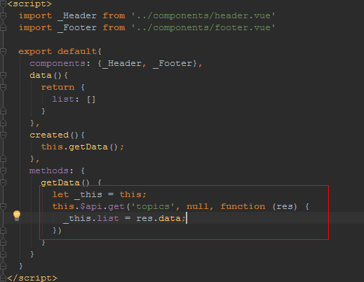
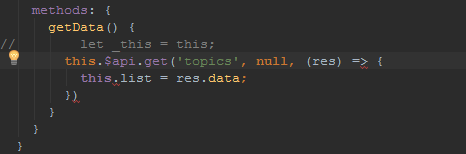

#### 打包项目
> npm run build

##### 1、删除.map文件
> 项目比较大的时候：1、这些文件非常大 2、编译时间非常长  删除：congfig/index中将productionSourceMap: false即可  再打包
##### 2、http-server
```javascript
注意：构建完成的包必须在http服务下才能跑起来，全局安装 npm install http-server -g
报错：-4048 无法完成安装  解决： 用管理员身份运行。  右键"开始" -- 命令提示符即可
```
##### 3、在dist中开启http服务
```javascript
cd  dist --- http-server -p 3000 随便定义端口号，不冲突即可
```
##### 4、当大型项目不在dist根目录
```javascript
config/index.js --- assetPublicPath:'/dist/' --- npm run build

assetsPublicPath："/"的时候npm run dev，这时候可以运行，在dist文件中http-server -p 3000 开启http服务，assetsPublicPath修改为:"/dist/" --- npm run biuld 此时可在localhost:9090和localhost:9090/dist#/中运行
```

#### 怎么在Vue中引入jquery
```javascript
因为已经安装了vue脚手架，所以需要在webpack中全局引入jquery
package.json --- dependencies { "jquery":"^2.2.3" } --- cnpm install --- 在webpack.base.js文件中加一行代码 ：  var webpack=require("webpack")
--- 在module.exports的最后加：
plugins: [
new webpack.optimize.CommonsChunkPlugin('common.js'),
new webpack.ProvidePlugin({
    jQuery: "jquery",
    $: "jquery"
})
]
--- 在main.js中加：  import $ from 'jquery' --- cnpm run dev
```

#### vue项目文件关系
https://segmentfault.com/q/1010000008863946

#### proxyTable遇到的问题
> 如何处理.json的接口，多个：将proxyTable中添加"/**.json"，target:"你要请求的域名"

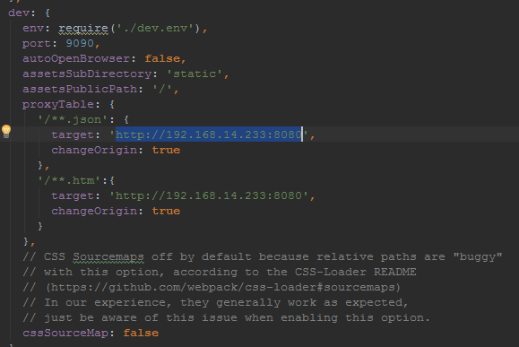

#### axios并发请求问题
> 这么解决：看图
  then()里的回调函数只会在请求返回成功后才会执行
  用数组的方式请求更好，用对象形势请求会报错，不知为何。

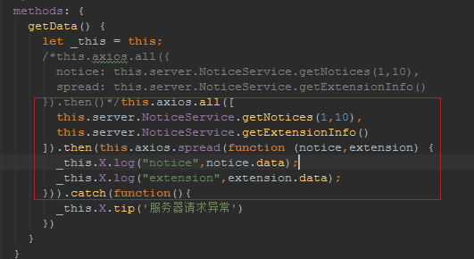

#### 路由查参数
> $route.query.路由中的变量名

#### vue怎么安装less-lader
> webpack.base.config.js中添加{
    test: /\.less$/,
    loader: 'style-loader!css-loader!less-loader'
  }
  --- cnpm install less less-loader --save

#### vue跳转页面
```javascript
router.push(/,,,) -- > this.$router.push({path:'/index'})
```

#### 安装vue-devtool
> http://www.cnblogs.com/lolDragon/p/6268345.html

#### axios的then里报错如何排查
> 在catch方法离加参数error，打印出来，在调试工具里不会出现，这样方便调试

#### 路由拦截器
> beforeEach()一个对routes遍历的方法，from：跳转前的路由对象，to跳转后的路由对象，next：跳转方法

#### 路由放参数的方式
不能跟path等参数放在同一等级，而要放在meta对象中，看图
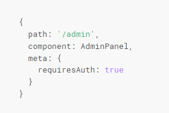

#### redirect
> 当访问/b的时候会自动跳转到/a
#### 别名alias
> 当访问/b的时候url不会变，实际访问的是/a

#### $route.params和$route.query的区别
> 前者获取定义的路由中route中后缀/:xxx的xxx参数
  后者获取后来添加的?xxx的xxx参数

#### 凡是涉及页面跳转的都用router-link
> router-link是封装后的vue中的a标签，比原生a标签跳转更快

#### v-for不能写在根元素template中，必须加个div
> rt

#### 动态引入图片
```javascript

```
#### 如何使用a标签的href
> 用:href即可

#### vue-swipe插件css问题
> 因为没有引用官方的css，详见banner.vue，老版本banner.vue被废弃成quit-banner，里面用了jq

#### props在data外！跟data平级！
> 因为props写在了data里，导致浪费了一天的事件，太粗心！

#### 在v-for指令的使用中注意
> 如果使用了v-for，最好绑定key，不然会有提示，:key="item.id" 不管这个id是不是存在，vue的提示会消失。

#### 如何在单页面应用中注册全局组件
> 在main.js中：Vue.component('xxx', xxx);  xxx： import来的

#### Promise.reject()
> 在控制面板抛出异常，并能定位，跟console.error()也能实现此功能，但是如果既然用了axios封装了Promise，那就用Promise.reject来处理好了

#### 只能有一个根元素
> 多个组件写在一个template时，要用div包裹，不然会提示Component template should contain exactly one root element

#### 组件标签书写规则
> xxx-xxxx  最好不要用驼峰命名，尽量服从W3C规则，小写-小写。

#### <ul>，<ol>，<table>，<select>标签问题
> 内部的元素如果是组件，组件用： <tr is="my-component "></>来写

#### 一个页面多次调用同一个组件时，如果模板内的变量要一起变，那么把变量写在外面，如果，要单独变，写在data里
一起变
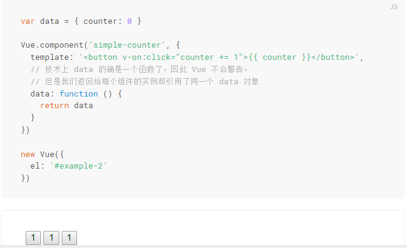
单独变
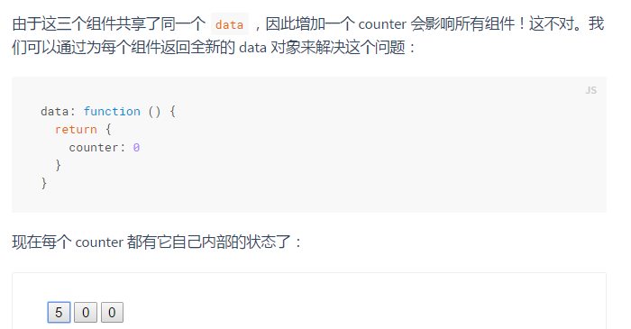

#### 子组件的props都用字符串来写

#### 子组件绑定对象
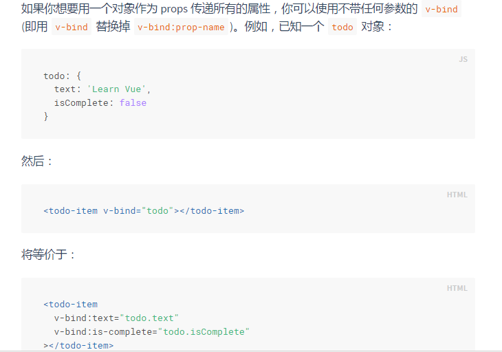

#### 子组件如何处理props变量
> 子组件如果要用到props的变量来操作的话，1、将props变量复制给一个新的变量，2、在computed方法中写方法操作props变量并返回

#### 组件内可用v-html
> 绑定父级传给子组件的参数。可以将其转换成html

#### transition 使用注意：
> 可以给整个弹框的外部设置一个transition，内部设置无用

#### vue项目绑定动态图片链接相关问题
> 将图片的动态链接地址保存为变量，然后在模板中用:src将其绑定，详见register1.vue

#### tip组件无法多次提示问题
> 原因：tip提示后，在定时器内被设置样式为none，所以后续的提示都不会展示
  解决：如果去掉样式设置，会造成提示动画消失后，该提示的组件一直显示在页面上，所以，决定将显示控制移交给父组件。
  在tip组件定时器中声明$emit('hide')，在父组件中@hide=""showTip = false"即可，详见tip.vue组件

#### 引用全局变量注意
> 全局变量引用时，需要将其保存在本地，否则会导致有些应用无法成功。
  遇到的问题：global.showTip能取到，但是无法对其进行操作。

#### a标签和router-link的差
> 在vue中不能想angular中一样，直接将变量拼接到链接中，而要用router-link标签中的:to来绑定如果携带参数，则用query的方式来携带，详见图右
    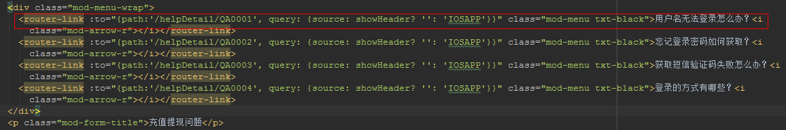
  router-link的优势：
  无论是 HTML5 history 模式还是 hash 模式，它的表现行为一致，所以，当你要切换路由模式，或者在 IE9 降级使用 hash 模式，无须作任何变动。
  在 HTML5 history 模式下，router-link 会守卫点击事件，让浏览器不再重新加载页面。
  当你在 HTML5 history 模式下使用 base 选项之后，所有的 to 属性都不需要写（基路径）了。

#### 如何在webstorm新建.vue模板文件
> settings --- Editor --- File and Code Templates --- 点加号 --- 在name里写： Vue File 扩展名写：vue --- 在下面的大框内书写你编辑好的模板 --- apply --- ok

#### 根据路由显示页面内容
> 详见vue项目的tradeRule页面，根据路由判断期货种类，再抽取对应的文字来显示。

#### 页面渲染由异步请求的数据，在渲染过程中变量不存在，在控制台报错，但是功能正常
> 在用到该变量的html代码前加v-if 确保该变量存在， v-if="a && a .length < 3"等等诸如此类的写法

#### v-for与ng-repeat区别
> v-for="(item1,item2) in Obj"item1和item2分别为obj的0,1元素
  而ng-repeat恰好相反， item1和item2分别为obj的1,0元素。ng应该是给obj反向遍历，拿最后两个元素，也就是正想遍历的第二第一个，只是这么猜

#### $router根据作用域，只能是vue根作用域，this,取不到就在func开始的时候赋值this给t

#### 如何解决弹框后跳转页面，由于弹框组件时双向绑定，导致弹框没出现，页面直接跳转了，等第二次进入才弹框
> 用户密码修改，弹框出现，然后跳转，在login页面也会出现那个弹框，然后消失，不知道怎么回事。用户密码修改后先是signout()方法，然后跳转，将该方法放在修改交易密码时也能让弹框正常显示。所以，我的解决办法1：设置定时器，给足够的时间给showTip赋值，然后显示，然后跳转。

#### 如何删除对象中的某个属性
> delete obj.key；

#### backURL携带参数解决办法
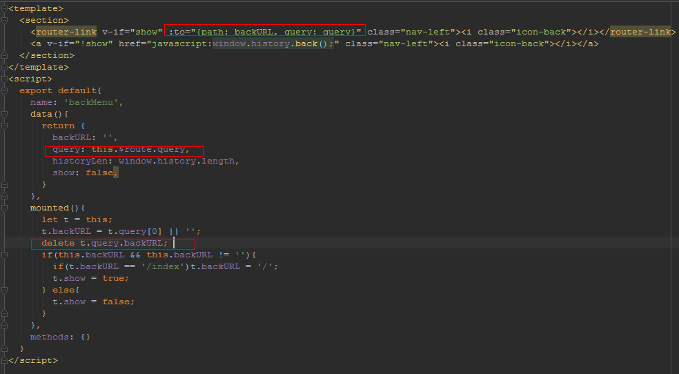

#### 路由的params变化页面无变化问题
> 由于只有parmas变化，页面不会刷新，处理：跳转后window.location.reload(); <b style="color: red">该方法不妥，后续解决了再来更新</b>

#### import要写在文件的顶部
必须写在new Vue之前。不然不会将其实例化进入vue实例

#### $route / $router
> 路由参数全部由$route来取
  用来跳转

#### fetch
> 新的异步请求方法 -- 之后学习

#### vue双向绑定的简单模拟
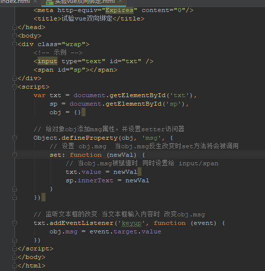

#### vue的异步dom更新
> 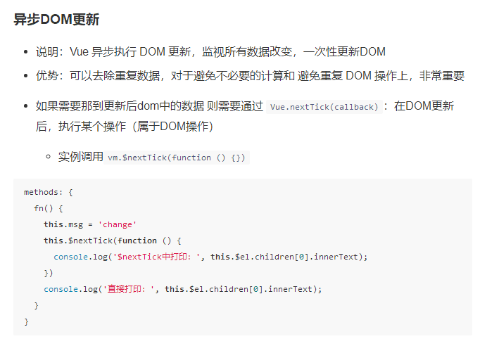

#### vue知识点
> https://juejin.im/entry/5a54b747518825734216c3df?utm_source=gold_browser_extension


