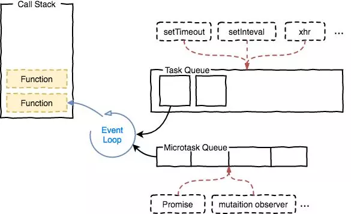
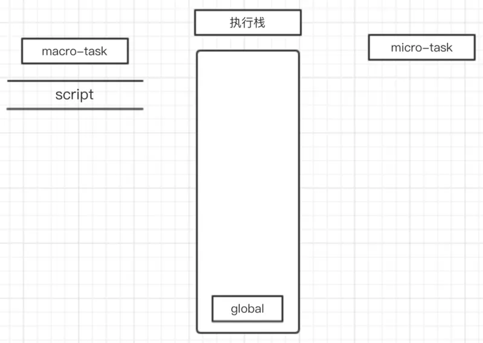
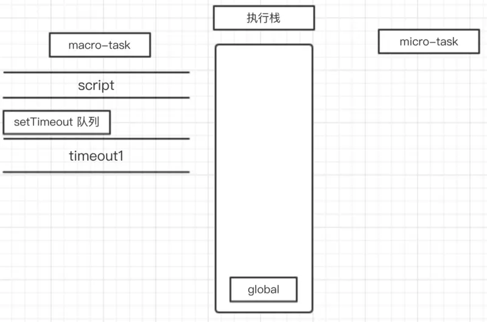
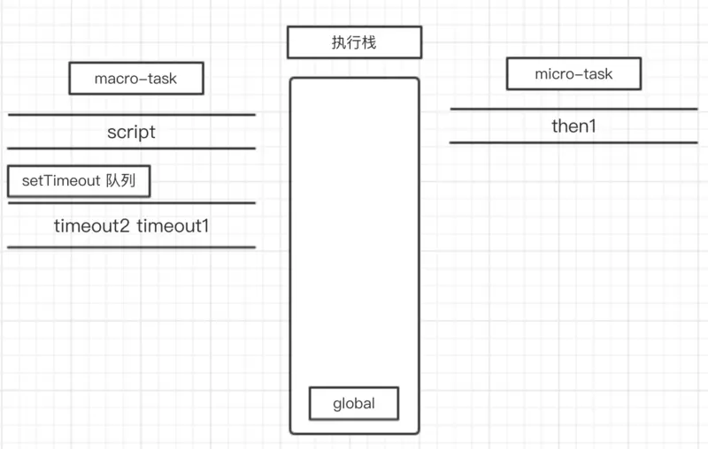
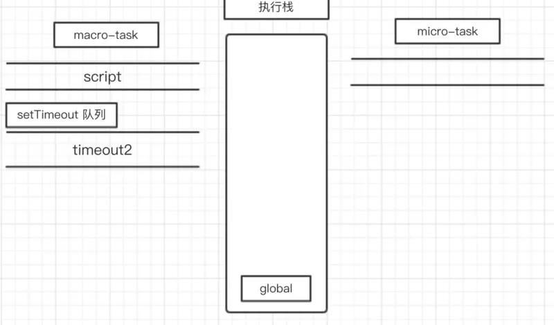

<a href="https://juejin.im/entry/5a8bc3215188257a856f4b2b/">原文</a>
转载来自掘金一篇文章，自己再写一遍加深记忆

> 阮老师在其推特上放了一道题：
  ```javascript
  new Promise(resolve => {
        resolve(1);
        Promise.resolve().then(() => console.log(2));
        console.log(4)
    }).then(t => console.log(t));
    console.log(3);
    ```

看到此处的你可以先猜测下其答案，然后再在浏览器的控制台运行这段代码，看看运行结果是否和你的猜测一致。

## 事件循环
众所周知，JavaScript 语言的一大特点就是单线程，也就是说，同一个时间只能做一件事。根据 <a style="color: blue" href="https://www.w3.org/TR/html5/webappapis.html#event-loops">HTML 规范</a> ：
> To coordinate events, user interaction, scripts, rendering, networking, and so forth, user agents must use event loops as described in this section. There are two kinds of event loops: those for browsing contexts, and those for workers.

为了协调事件、用户交互、脚本、UI 渲染和网络处理等行为，防止主线程的不阻塞，Event Loop 的方案应用而生。Event Loop 包含两类：一类是基于 Browsing Context，一种是基于 Worker。二者的运行是独立的，也就是说，每一个 JavaScript 运行的"线程环境"都有一个独立的 Event Loop，每一个 Web Worker 也有一个独立的 Event Loop。
> 本文所涉及到的事件循环是基于 Browsing Context。

那么在事件循环机制中，又通过什么方式进行函数调用或者任务的调度呢？

## 任务队列
根据规范，事件循环是通过任务队列的机制来进行协调的。一个 Event Loop 中，可以有一个或者多个任务队列(task queue)，一个任务队列便是一系列有序任务(task)的集合；每个任务都有一个任务源(task source)，源自同一个任务源的 task 必须放到同一个任务队列，从不同源来的则被添加到不同队列。

在事件循环中，每进行一次循环操作称为 tick，每一次 tick 的任务处理模型是比较复杂的，但关键步骤如下：
    - 在此次 tick 中选择最先进入队列的任务(oldest task)，如果有则执行(一次)
    - 检查是否存在 Microtasks，如果存在则不停地执行，直至清空 Microtasks Queue
    - 更新 render
    - 主线程重复执行上述步骤

仔细查阅规范可知，异步任务可分为 **task**和 **microtask** 两类，不同的API注册的异步任务会依次进入自身对应的队列中，然后等待 Event Loop 将它们依次压入执行栈中执行。
> 查阅了网上比较多关于事件循环介绍的文章，均会提到 macrotask(宏任务) 和 microtask(微任务) 两个概念，但规范中并没有提到 macrotask，因而一个比较合理的解释是 task 即为其它文章中的 macrotask。另外在 ES2015 规范中称为 microtask 又被称为 Job。

(macro)task主要包含：script(整体代码)、setTimeout、setInterval、I/O、UI交互事件、setImmediate(Node.js 环境)

microtask主要包含：Promise、MutaionObserver、process.nextTick(Node.js 环境)

>在 Node 中，会优先清空 next tick queue，即通过process.nextTick 注册的函数，再清空 other queue，常见的如Promise

setTimeout/Promise 等API便是任务源，而进入任务队列的是他们指定的具体执行任务。来自不同任务源的任务会进入到不同的任务队列。其中setTimeout与setInterval是同源的。


## 示例
纯文字表述确实有点干涩，这一节通过一个示例来逐步理解：
```javascript
console.log('script start');

setTimeout(function() {
  console.log('timeout1');
}, 10);

new Promise(resolve => {
    console.log('promise1');
    resolve();
    setTimeout(() => console.log('timeout2'), 10);
}).then(function() {
    console.log('then1')
})

console.log('script end');
```
首先，事件循环从宏任务(macrotask)队列开始，这个时候，宏任务队列中，只有一个script(整体代码)任务；当遇到任务源(task source)时，则会先分发任务到对应的任务队列中去。所以，上面例子的第一步执行如下图所示：

然后遇到了 console 语句，直接输出 script start。输出之后，script 任务继续往下执行，遇到 setTimeout，其作为一个宏任务源，则会先将其任务分发到对应的队列中

script 任务继续往下执行，遇到 Promise 实例。Promise 构造函数中的第一个参数，是在 new 的时候执行，构造函数执行时，里面的参数进入执行栈执行；而后续的 .then 则会被分发到 microtask 的 Promise 队列中去。所以会先输出 promise1，然后执行 resolve，将 then1 分配到对应队列。
构造函数继续往下执行，又碰到 **setTimeout**，然后将对应的任务分配到对应队列：

script任务继续往下执行，最后只有一句输出了 script end，至此，全局任务就执行完毕了。
根据上述，每次执行完一个宏任务之后，会去检查是否存在 Microtasks；如果有，则执行 Microtasks 直至清空 Microtask Queue。
因而在script任务执行完毕之后，开始查找清空微任务队列。此时，微任务中，只有 **Promise** 队列中的一个任务 **then1**，因此直接执行就行了，执行结果输出 **then1**。当所有的 **microtast** 执行完毕之后，表示第一轮的循环就结束了。

这个时候就得开始第二轮的循环。第二轮循环仍然从宏任务 **macrotask**开始。此时，有两个宏任务：**timeout1** 和 **timeout2**。
取出 **timeout1** 执行，输出 **timeout1**。此时微任务队列中已经没有可执行的任务了，直接开始第三轮循环：

第三轮循环依旧从宏任务队列开始。此时宏任务中只有一个 timeout2，取出直接输出即可。
这个时候宏任务队列与微任务队列中都没有任务了，所以代码就不会再输出其他东西了。那么例子的输出结果就显而易见：
```javascript
script start
promise1
script end
then1
timeout1
timeout2
```

## 总结
在回头看本文最初的题目：
```javascript
new Promise(resolve => {
    resolve(1);

    Promise.resolve().then(() => {
    	// t2
    	console.log(2)
    });
    console.log(4)
}).then(t => {
	// t1
	console.log(t)
});
console.log(3);
```
这段代码的流程大致如下：
> 1、script 任务先运行。首先遇到 Promise 实例，构造函数首先执行，所以首先输出了 4。此时 microtask 的任务有 t2 和 t1
  2、script 任务继续运行，输出 3。至此，第一个宏任务执行完成。
  3、执行所有的微任务，先后取出 t2 和 t1，分别输出 2 和 1
  4、代码执行完毕

综上，上述代码的输出是：4321
为什么 t2 会先执行呢？理由如下：

- 根据<a href="http://www.ituring.com.cn/article/66566">Promises/A+规范：</a>
> 实践中要确保 onFulfilled 和 onRejected 方法异步执行，且应该在 then 方法被调用的那一轮事件循环之后的新执行栈中执行

- **Promise.resolve** 方法允许调用时不带参数，直接返回一个resolved 状态的 Promise 对象。立即 resolved 的 Promise 对象，是在本轮“事件循环”（event loop）的结束时，而不是在下一轮“事件循环”的开始时。
http://es6.ruanyifeng.com/#docs/promise#Promise-resolve

