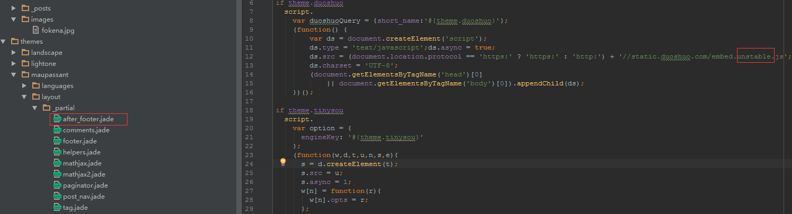

## 添加图片和评论功能时遇到的问题
### 添加图片：
引用方式：
```javascript

```
引用本地：
```javascript

```
注意：在images前必须要有/不然引用失败！

### 添加多说评论功能
多说是一个开源的，提供分享到社交平台并提供给使用者管理评论内容的这么一个插件，说实话很好用，配上我blog的mau主题显得很不错;
添加方法：
```javascript
在多说上申请自己的账号和域名后;
在主题的config.yml文件的duoshuo:栏中加上自己域名简称就行;
用多说的unstable版本，原因：最新稳定版会导致分享显示的社交平台为undefined;
```
不明白的话可以看下图


### 写页面的时候遇到的层级写错导致的页面错乱问题
在点卖页面有三个弹窗：点卖当前策略、点卖所有策略、设置止盈止损，本来么没什么大问题的，我觉得结算页面的体验不好，因为上头的导航栏不是固定死的，如果用户滑到很下面，要看点卖页面岂不是要重新滑到头部才能看[赢策略](http://ycl.yztz.com)（只支持手机端，如果你用电脑端pc模式看的话我可不管你的眼睛了）
然后嘛，设置头fixed,然后上下距离啥的就不多说了，出现问题了！前面一个多月！20多号人都没发现的问题！弹窗后居然还可以点上面的切换交易品种栏。- -当时就被强哥骂了一顿，还好老子脸皮厚；弹窗灰度背景直接飞到10000，弹窗10001；bingo！
