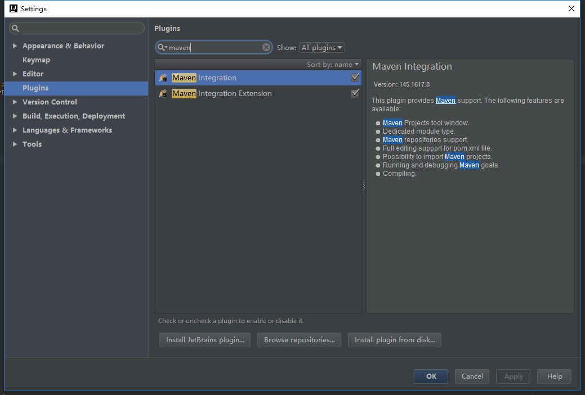
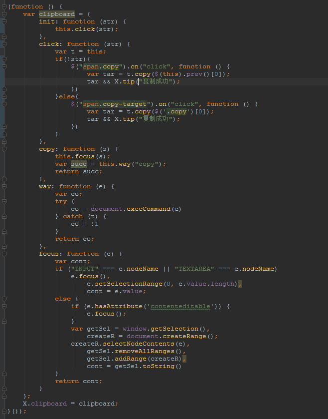
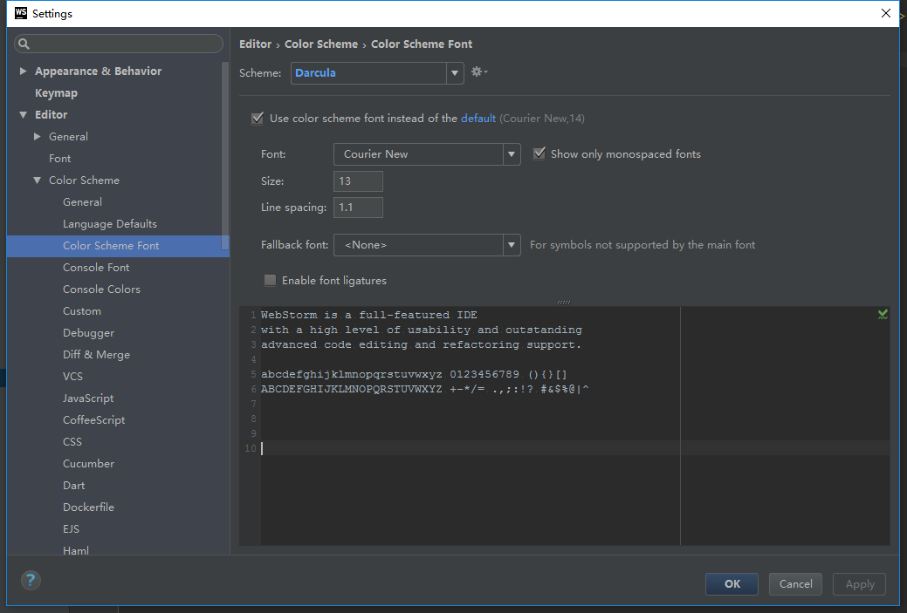
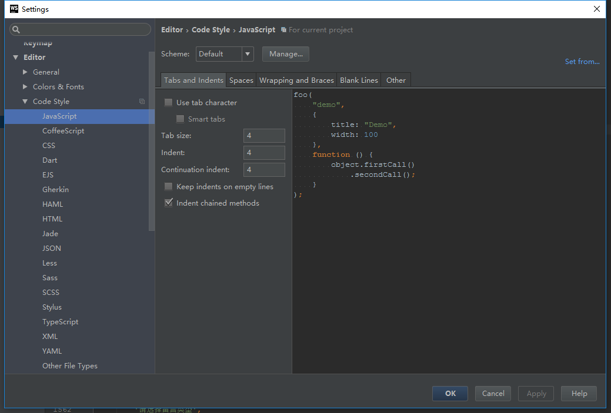
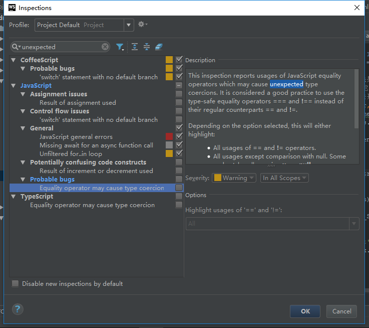
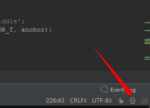

### 杂知识点
#### localhost无法启动
> 刚开始一直以为是nginx的问题，启动IDEA后提示我参数的maven出问题了，然后就把maven勾上就可以了。

##### 如何将xlmx文件的保存的图片全部原尺寸导出
> 因为为了减少图片所占用的空间，在表格中一般都会将其缩小，但是在写md文档的时候，复制粘贴只能将缩略图复制过来，很模糊看不清，所以我去网上找到了办法，将xlmx文件直接改成rar或者zip文件，然后解压，在xl文件下的media文件中就是你所保存的所有原尺寸图片。

##### webstorm快捷键关键词
> keyMap，按键设置：
  fold：折叠，
  reformat code：格式化代码
  redo、undo：撤销，取消撤销。

##### 切分支遇到的问题
> npm install      npm install express   还有nginx.conf文件出错：没有用location ~quote导致一直被重定向到welcome to nginx页面。具体原因不知。有空去琢磨
##### win10打开照片无效注册表值
<a href="https://jingyan.baidu.com/article/1876c8526e0ff0890b13762b.html">Win10打开照片提示“无效的注册表值”解决方法</a>
> win + r ,输入PowerShell  ，  输入Get-AppxPackage *photo* | Remove-AppxPackage后回车。

#### 浏览器复制粘贴功能
> 在本项目中，没有调用第三方的插件(如：ZeroClipboard )。由于该插件要用刀flash插件，但是越来越多的浏览器厂商要废除flash，于是不建议用词插件。用自带的复制粘贴功能clipBoard。详见yztz.js。此方法用到的几个关键方法及属性:
  execCommand():当一个HTML文档切换到设计模式(designMode)时，文档对象暴露 execCommand方法，该方法允许运行命令来操纵可编辑区域的内容。大多数命令影响文档的选择（粗体，斜体等），而其他命令插入新元素（添加链接）或影响整行（缩进）。当使用 contentEditable时，调用 execCommand() 将影响当前活动的可编辑元素。
  bool = document.execCommand(aCommandName, aShowDefaultUI, aValueArgument)  -->一个 Boolean ，如果是 false 则表示操作不被支持或未被启用。
  setSelectionRange()：属于input元素的方法，取到input内文本的头尾将其选中。并将其拷贝至浏览器剪切板
  contenteditable属性: 可设置元素是否可编辑  true : 可编辑
  focus(): DOM对象的方法，将输入焦点移至对象上
  getSelection():返回一个  Selection 对象，表示用户选择的文本范围或插入符号的当前位置。要将其转换成字符串可加""或者toString()
  createRange():创建 Range 对象。  range对象 ： Range 对象表示文档的连续范围区域，如用户在浏览器窗口中用鼠标拖动选中的区域。
  selectNodeContents(refNode):把范围边界设置为一个节点的子节点。 refNode : 其子节点将成为当前范围的内容的节点。
  a.removeAllRanges(): 将a的所有range对象清除
  getSel.addRange(createR): 将range对象赋给getSel
  总结：猜测：点击复制后想被复制的el被选中，然后取到其范围(input的rang对象)，再创建一个连续文本的对象，即选中的。将input的文本节点设置成当前范围内容的节点。清除input范围，将input子节点的范围设置给getSel。于是页面会显示文本变色，不会整个input变色，如过input很大的话

#### webstorm设置
> 激活 -- 在线生成激活（从2017开始无法修改本地时间来试用）
  设置 -- 字体相关设置 ： 左侧栏设置在Appearance设置里， 主题：Darcular， 字体：微软雅黑UI， 字体大小：12
  编辑区域设置 -- 在Editor -- Color Scheme Font -- 可直接设置大小，不用设置copy
  我喜欢的设置 -- 主题：Darcular，左侧栏设置看上面，编辑区域设置 -- 字体： Courier New ,大小13，行间距1.1
  code-style设置：
  
  

#### webstorm语句提示
> 提示设置在右下角的人头，点击设置config，因为使用了 == 导致所有判断==的都会有若提示，如何解决： 搜索unexpected，取消勾选

#### webstorm激活
> 链接：https://www.iteblog.com/archives/1542.html
电脑描述： STone， 注册码： EB101IWSWD-eyJsaWNlbnNlSWQiOiJFQjEwMUlXU1dEIiwibGljZW5zZWVOYW1lIjoibGFuIHl1IiwiYXNzaWduZWVOYW1lIjoiIiwiYXNzaWduZWVFbWFpbCI6IiIsImxpY2Vuc2VSZXN0cmljdGlvbiI6IkZvciBlZHVjYXRpb25hbCB1c2Ugb25seSIsImNoZWNrQ29uY3VycmVudFVzZSI6ZmFsc2UsInByb2R1Y3RzIjpbeyJjb2RlIjoiSUkiLCJwYWlkVXBUbyI6IjIwMTgtMTAtMTQifSx7ImNvZGUiOiJSUzAiLCJwYWlkVXBUbyI6IjIwMTgtMTAtMTQifSx7ImNvZGUiOiJXUyIsInBhaWRVcFRvIjoiMjAxOC0xMC0xNCJ9LHsiY29kZSI6IlJEIiwicGFpZFVwVG8iOiIyMDE4LTEwLTE0In0seyJjb2RlIjoiUkMiLCJwYWlkVXBUbyI6IjIwMTgtMTAtMTQifSx7ImNvZGUiOiJEQyIsInBhaWRVcFRvIjoiMjAxOC0xMC0xNCJ9LHsiY29kZSI6IkRCIiwicGFpZFVwVG8iOiIyMDE4LTEwLTE0In0seyJjb2RlIjoiUk0iLCJwYWlkVXBUbyI6IjIwMTgtMTAtMTQifSx7ImNvZGUiOiJETSIsInBhaWRVcFRvIjoiMjAxOC0xMC0xNCJ9LHsiY29kZSI6IkFDIiwicGFpZFVwVG8iOiIyMDE4LTEwLTE0In0seyJjb2RlIjoiRFBOIiwicGFpZFVwVG8iOiIyMDE4LTEwLTE0In0seyJjb2RlIjoiUFMiLCJwYWlkVXBUbyI6IjIwMTgtMTAtMTQifSx7ImNvZGUiOiJDTCIsInBhaWRVcFRvIjoiMjAxOC0xMC0xNCJ9LHsiY29kZSI6IlBDIiwicGFpZFVwVG8iOiIyMDE4LTEwLTE0In0seyJjb2RlIjoiUlNVIiwicGFpZFVwVG8iOiIyMDE4LTEwLTE0In1dLCJoYXNoIjoiNjk0NDAzMi8wIiwiZ3JhY2VQZXJpb2REYXlzIjowLCJhdXRvUHJvbG9uZ2F0ZWQiOmZhbHNlLCJpc0F1dG9Qcm9sb25nYXRlZCI6ZmFsc2V9-Gbb7jeR8JWOVxdUFaXfJzVU/O7c7xHQyaidCnhYLp7v32zdeXiHUU7vlrrm5y9ZX0lmQk3plCCsW+phrC9gGAPd6WDKhkal10qVNg0larCR2tQ3u8jfv1t2JAvWrMOJfFG9kKsJuw1P4TozZ/E7Qvj1cupf/rldhoOmaXMyABxNN1af1RV3bVhe4FFZe0p7xlIJF/ctZkFK62HYmh8V3AyhUNTzrvK2k+t/tlDJz2LnW7nYttBLHld8LabPlEEjpTHswhzlthzhVqALIgvF0uNbIJ5Uwpb7NqR4U/2ob0Z+FIcRpFUIAHEAw+RLGwkCge5DyZKfx+RoRJ/In4q/UpA==-MIIEPjCCAiagAwIBAgIBBTANBgkqhkiG9w0BAQsFADAYMRYwFAYDVQQDDA1KZXRQcm9maWxlIENBMB4XDTE1MTEwMjA4MjE0OFoXDTE4MTEwMTA4MjE0OFowETEPMA0GA1UEAwwGcHJvZDN5MIIBIjANBgkqhkiG9w0BAQEFAAOCAQ8AMIIBCgKCAQEAxcQkq+zdxlR2mmRYBPzGbUNdMN6OaXiXzxIWtMEkrJMO/5oUfQJbLLuMSMK0QHFmaI37WShyxZcfRCidwXjot4zmNBKnlyHodDij/78TmVqFl8nOeD5+07B8VEaIu7c3E1N+e1doC6wht4I4+IEmtsPAdoaj5WCQVQbrI8KeT8M9VcBIWX7fD0fhexfg3ZRt0xqwMcXGNp3DdJHiO0rCdU+Itv7EmtnSVq9jBG1usMSFvMowR25mju2JcPFp1+I4ZI+FqgR8gyG8oiNDyNEoAbsR3lOpI7grUYSvkB/xVy/VoklPCK2h0f0GJxFjnye8NT1PAywoyl7RmiAVRE/EKwIDAQABo4GZMIGWMAkGA1UdEwQCMAAwHQYDVR0OBBYEFGEpG9oZGcfLMGNBkY7SgHiMGgTcMEgGA1UdIwRBMD+AFKOetkhnQhI2Qb1t4Lm0oFKLl/GzoRykGjAYMRYwFAYDVQQDDA1KZXRQcm9maWxlIENBggkA0myxg7KDeeEwEwYDVR0lBAwwCgYIKwYBBQUHAwEwCwYDVR0PBAQDAgWgMA0GCSqGSIb3DQEBCwUAA4ICAQC9WZuYgQedSuOc5TOUSrRigMw4/+wuC5EtZBfvdl4HT/8vzMW/oUlIP4YCvA0XKyBaCJ2iX+ZCDKoPfiYXiaSiH+HxAPV6J79vvouxKrWg2XV6ShFtPLP+0gPdGq3x9R3+kJbmAm8w+FOdlWqAfJrLvpzMGNeDU14YGXiZ9bVzmIQbwrBA+c/F4tlK/DV07dsNExihqFoibnqDiVNTGombaU2dDup2gwKdL81ua8EIcGNExHe82kjF4zwfadHk3bQVvbfdAwxcDy4xBjs3L4raPLU3yenSzr/OEur1+jfOxnQSmEcMXKXgrAQ9U55gwjcOFKrgOxEdek/Sk1VfOjvS+nuM4eyEruFMfaZHzoQiuw4IqgGc45ohFH0UUyjYcuFxxDSU9lMCv8qdHKm+wnPRb0l9l5vXsCBDuhAGYD6ss+Ga+aDY6f/qXZuUCEUOH3QUNbbCUlviSz6+GiRnt1kA9N2Qachl+2yBfaqUqr8h7Z2gsx5LcIf5kYNsqJ0GavXTVyWh7PYiKX4bs354ZQLUwwa/cG++2+wNWP+HtBhVxMRNTdVhSm38AknZlD+PTAsWGu9GyLmhti2EnVwGybSD2Dxmhxk3IPCkhKAK+pl0eWYGZWG3tJ9mZ7SowcXLWDFAk0lRJnKGFMTggrWjV8GYpw5bq23VmIqqDLgkNzuoog==

电脑描述： stone, 注册码： EB101IWSWD-eyJsaWNlbnNlSWQiOiJFQjEwMUlXU1dEIiwibGljZW5zZWVOYW1lIjoibGFuIHl1IiwiYXNzaWduZWVOYW1lIjoiIiwiYXNzaWduZWVFbWFpbCI6IiIsImxpY2Vuc2VSZXN0cmljdGlvbiI6IkZvciBlZHVjYXRpb25hbCB1c2Ugb25seSIsImNoZWNrQ29uY3VycmVudFVzZSI6ZmFsc2UsInByb2R1Y3RzIjpbeyJjb2RlIjoiSUkiLCJwYWlkVXBUbyI6IjIwMTgtMTAtMTQifSx7ImNvZGUiOiJSUzAiLCJwYWlkVXBUbyI6IjIwMTgtMTAtMTQifSx7ImNvZGUiOiJXUyIsInBhaWRVcFRvIjoiMjAxOC0xMC0xNCJ9LHsiY29kZSI6IlJEIiwicGFpZFVwVG8iOiIyMDE4LTEwLTE0In0seyJjb2RlIjoiUkMiLCJwYWlkVXBUbyI6IjIwMTgtMTAtMTQifSx7ImNvZGUiOiJEQyIsInBhaWRVcFRvIjoiMjAxOC0xMC0xNCJ9LHsiY29kZSI6IkRCIiwicGFpZFVwVG8iOiIyMDE4LTEwLTE0In0seyJjb2RlIjoiUk0iLCJwYWlkVXBUbyI6IjIwMTgtMTAtMTQifSx7ImNvZGUiOiJETSIsInBhaWRVcFRvIjoiMjAxOC0xMC0xNCJ9LHsiY29kZSI6IkFDIiwicGFpZFVwVG8iOiIyMDE4LTEwLTE0In0seyJjb2RlIjoiRFBOIiwicGFpZFVwVG8iOiIyMDE4LTEwLTE0In0seyJjb2RlIjoiUFMiLCJwYWlkVXBUbyI6IjIwMTgtMTAtMTQifSx7ImNvZGUiOiJDTCIsInBhaWRVcFRvIjoiMjAxOC0xMC0xNCJ9LHsiY29kZSI6IlBDIiwicGFpZFVwVG8iOiIyMDE4LTEwLTE0In0seyJjb2RlIjoiUlNVIiwicGFpZFVwVG8iOiIyMDE4LTEwLTE0In1dLCJoYXNoIjoiNjk0NDAzMi8wIiwiZ3JhY2VQZXJpb2REYXlzIjowLCJhdXRvUHJvbG9uZ2F0ZWQiOmZhbHNlLCJpc0F1dG9Qcm9sb25nYXRlZCI6ZmFsc2V9-Gbb7jeR8JWOVxdUFaXfJzVU/O7c7xHQyaidCnhYLp7v32zdeXiHUU7vlrrm5y9ZX0lmQk3plCCsW+phrC9gGAPd6WDKhkal10qVNg0larCR2tQ3u8jfv1t2JAvWrMOJfFG9kKsJuw1P4TozZ/E7Qvj1cupf/rldhoOmaXMyABxNN1af1RV3bVhe4FFZe0p7xlIJF/ctZkFK62HYmh8V3AyhUNTzrvK2k+t/tlDJz2LnW7nYttBLHld8LabPlEEjpTHswhzlthzhVqALIgvF0uNbIJ5Uwpb7NqR4U/2ob0Z+FIcRpFUIAHEAw+RLGwkCge5DyZKfx+RoRJ/In4q/UpA==-MIIEPjCCAiagAwIBAgIBBTANBgkqhkiG9w0BAQsFADAYMRYwFAYDVQQDDA1KZXRQcm9maWxlIENBMB4XDTE1MTEwMjA4MjE0OFoXDTE4MTEwMTA4MjE0OFowETEPMA0GA1UEAwwGcHJvZDN5MIIBIjANBgkqhkiG9w0BAQEFAAOCAQ8AMIIBCgKCAQEAxcQkq+zdxlR2mmRYBPzGbUNdMN6OaXiXzxIWtMEkrJMO/5oUfQJbLLuMSMK0QHFmaI37WShyxZcfRCidwXjot4zmNBKnlyHodDij/78TmVqFl8nOeD5+07B8VEaIu7c3E1N+e1doC6wht4I4+IEmtsPAdoaj5WCQVQbrI8KeT8M9VcBIWX7fD0fhexfg3ZRt0xqwMcXGNp3DdJHiO0rCdU+Itv7EmtnSVq9jBG1usMSFvMowR25mju2JcPFp1+I4ZI+FqgR8gyG8oiNDyNEoAbsR3lOpI7grUYSvkB/xVy/VoklPCK2h0f0GJxFjnye8NT1PAywoyl7RmiAVRE/EKwIDAQABo4GZMIGWMAkGA1UdEwQCMAAwHQYDVR0OBBYEFGEpG9oZGcfLMGNBkY7SgHiMGgTcMEgGA1UdIwRBMD+AFKOetkhnQhI2Qb1t4Lm0oFKLl/GzoRykGjAYMRYwFAYDVQQDDA1KZXRQcm9maWxlIENBggkA0myxg7KDeeEwEwYDVR0lBAwwCgYIKwYBBQUHAwEwCwYDVR0PBAQDAgWgMA0GCSqGSIb3DQEBCwUAA4ICAQC9WZuYgQedSuOc5TOUSrRigMw4/+wuC5EtZBfvdl4HT/8vzMW/oUlIP4YCvA0XKyBaCJ2iX+ZCDKoPfiYXiaSiH+HxAPV6J79vvouxKrWg2XV6ShFtPLP+0gPdGq3x9R3+kJbmAm8w+FOdlWqAfJrLvpzMGNeDU14YGXiZ9bVzmIQbwrBA+c/F4tlK/DV07dsNExihqFoibnqDiVNTGombaU2dDup2gwKdL81ua8EIcGNExHe82kjF4zwfadHk3bQVvbfdAwxcDy4xBjs3L4raPLU3yenSzr/OEur1+jfOxnQSmEcMXKXgrAQ9U55gwjcOFKrgOxEdek/Sk1VfOjvS+nuM4eyEruFMfaZHzoQiuw4IqgGc45ohFH0UUyjYcuFxxDSU9lMCv8qdHKm+wnPRb0l9l5vXsCBDuhAGYD6ss+Ga+aDY6f/qXZuUCEUOH3QUNbbCUlviSz6+GiRnt1kA9N2Qachl+2yBfaqUqr8h7Z2gsx5LcIf5kYNsqJ0GavXTVyWh7PYiKX4bs354ZQLUwwa/cG++2+wNWP+HtBhVxMRNTdVhSm38AknZlD+PTAsWGu9GyLmhti2EnVwGybSD2Dxmhxk3IPCkhKAK+pl0eWYGZWG3tJ9mZ7SowcXLWDFAk0lRJnKGFMTggrWjV8GYpw5bq23VmIqqDLgkNzuoog==

License Server 地址： http://idea.iteblog.com/key.php

#### 破解版webstorm汉化方式
> 将备用软件里的webstorm2016.1.1安装完成后，把CN结尾的压缩包解压，将cn文件和jar文件放到webstorm安装目录下的lib文件夹中，重启webstorm即可，但是一般不需要汉化，作为程序员，这点引文是必须要看懂的

#### 电脑删除无效/新建文件无效/不会自动刷新
> 链接： http://jingyan.baidu.com/article/d2b1d102947cbe5c7e37d427.html

#### 如何把xlms表格里的图片一起导出
> 将文件直接改成rar文件，然后解压，在xl文件下的media文件下

