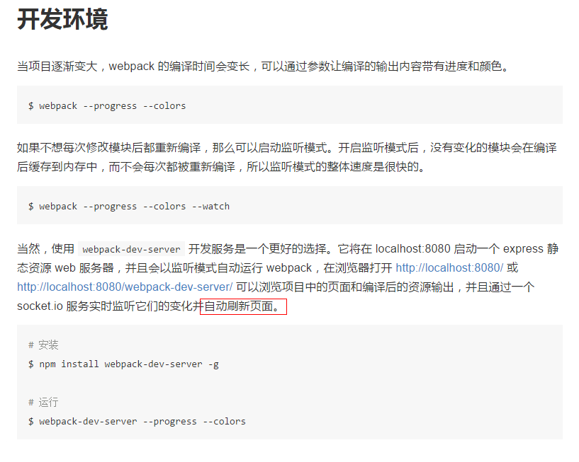
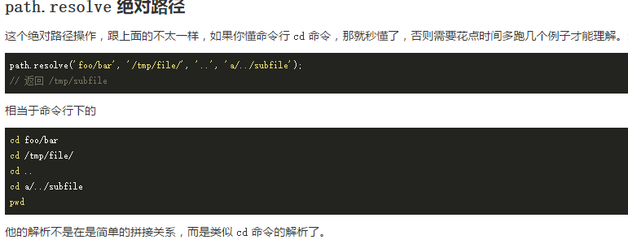
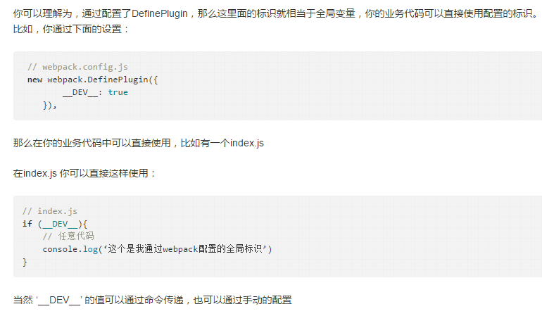
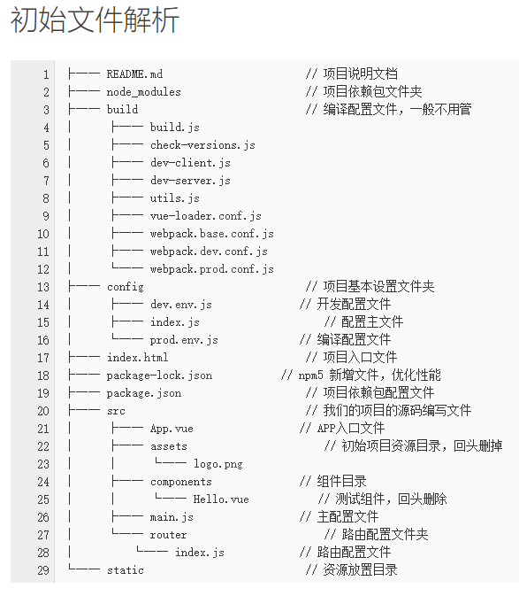
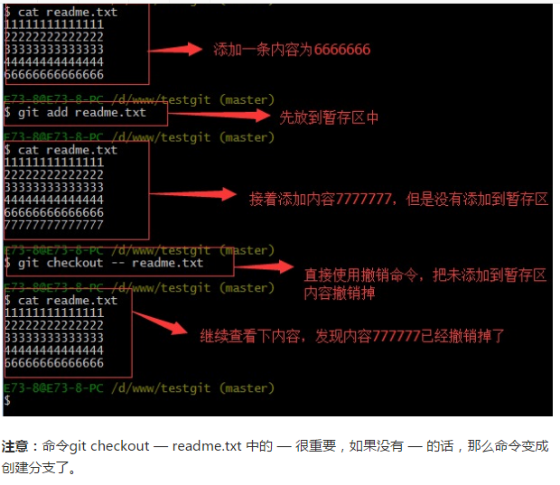
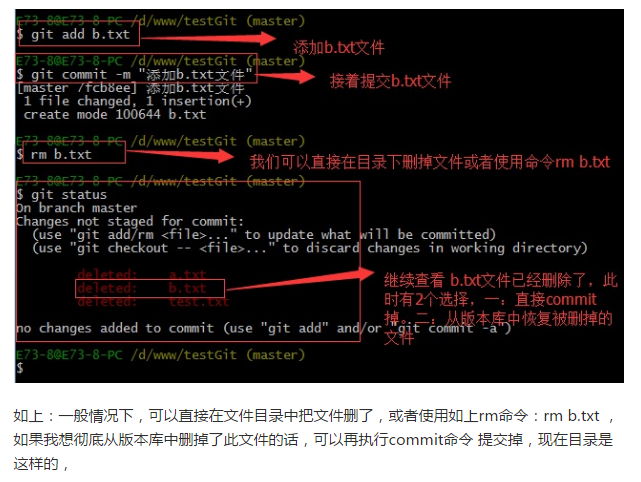
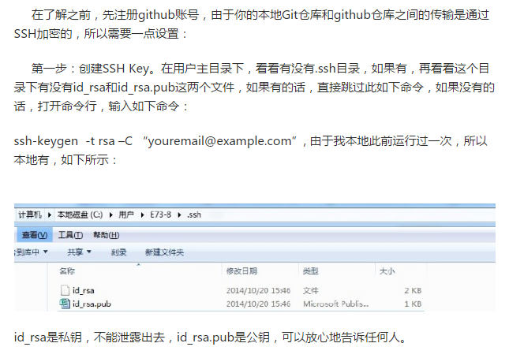
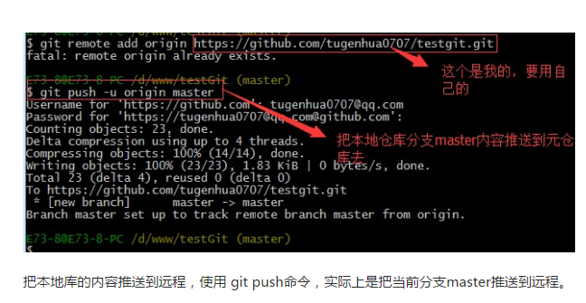

#### pm2守护进程
 全局安装pm2 ： npm install -g pm2
  进项目启动server.js，托管给express的端口号。地址等等
  clb监听的是4444 ，wcl3333，改nginx端口号：wcl8080，clb8888，本地localhost：wcl3333，clb4444

#### webpack
Webpack 会分析入口文件，解析包含依赖关系的各个文件。这些文件（模块）都打包到 bundle.js 。Webpack 会给每个模块分配一个唯一的 id 并通过这个 id 索引和访问模块。在页面启动时，会先执行 entry.js 中的代码，其它模块会在运行 require 的时候再执行。

#### CSS loader前缀问题
> 如果每次 require CSS 文件的时候都要写 loader 前缀，是一件很繁琐的事情。我们可以根据模块类型（扩展名）来自动绑定需要的 loader。
  将 entry.js 中的 require("!style!css!./style.css") 修改为 require("./style.css") ，然后执行：
  $ webpack entry.js bundle.js --module-bind 'css=style-loader!css-loader'
  "#" 有些环境下可能需要使用双引号
  $ webpack entry.js bundle.js --module-bind "css=style-loader!css-loader"
  建议都用""在执行的时候报错。""没问题

#### webpack遇到的问题
> 在config阶段无法执行命令行：webpack,解决：重新npm install
  在执行的时候，除了在命令行传入参数，还可以通过指定的配置文件来执行。默认情况下，会搜索当前目录的 webpack.config.js 文件
#### webpack-dev-server
> 用该命令开发，会在localhost：8080创建一个express静态web服务器，会自动刷新页面


#### Xshell和Xftp使用
> Xshell打开新建会话，输入你要上传文件的地址。输入账号密码后点击"新建文件传输"，找到要替换的文件的地址将其替换即可。
  Xshell打开新建终端，链接成功后，新建文件传输，这里自动会打开xftp，不用手动打开xftp并在上面操作。

#### --save-dev的作用
> “—save-dev”的意思是，在当前目录安装grunt的同时，顺便把grunt保存为这个目录的开发依赖项。配置package.json时，其中的“devDependencies”中就会存储开发依赖项。  不加-dev，，就会保存在dependencies下

#### grunt-contrib-copy
> 自动复制文件

#### grunt-contrib-concat
> 将多个类库写到一个总的类库中减少请求增快响应速度。类似于app.min.js   --参见wcl

#### grunt-contrib-uglify
> 压缩代码，mangle:fale 不混淆变量名
   preserveComments: 'all', //不删除注释，还可以为 false（删除全部注释）
  report: "min"//输出压缩率，可选的值有 false(不输出信息)   详见 ： http://www.cnblogs.com/artwl/p/3449303.html

#### 编译scss
> 下载ruby最近版本 - 安装 - 设置编辑器file watcher - Program 地址：安装目录ruby/ bat / scss.bat

#### nginx跨域
```javascript
listen：监听的端口，数据交互的端口。
location /  --- 所有以/开头的地址，实际上是所有请求
root  html   ---- 去请求../html文件夹里的文件,其中..的路径在nginx里面有定义，安装的时候会有默认路径
index  index.html index.htm  ＃首页响应地址
```

#### 什么是反向代理
> 通常的代理服务器，只用于代理内部网络对Internet的连接请求，客户机必须指定代理服务器,并将本来要直接发送到Web服务器上的http请求发送到代理服务器中。由于外部网络上的主机并不会配置并使用这个代理服务器，普通代理服务器也被设计为在Internet上搜寻多个不确定的服务器,而不是针对Internet上多个客户机的请求访问某一个固定的服务器，因此普通的Web代理服务器不支持外部对内部网络的访问请求。当一个代理服务器能够代理外部网络上的主机，访问内部网络时，这种代理服务的方式称为反向代理服务。此时代理服务器对外就表现为一个Web服务器，外部网络就可以简单把它当作一个标准的Web服务器而不需要特定的配置。不同之处在于，这个服务器没有保存任何网页的真实数据，所有的静态网页或者CGI程序，都保存在内部的Web服务器上。因此对反向代理服务器的攻击并不会使得网页信息遭到破坏，这样就增强了Web服务器的安全性。
  https://baike.baidu.com/item/%E5%8F%8D%E5%90%91%E4%BB%A3%E7%90%86/7793488?fr=aladdin
  https://www.zhihu.com/question/24723688
  nginx启动后，我在代理连接写好后，nginx服务是直接可以请求某个域名的某个链接的数据的
  所以是只有js这一种语言存在跨域问题，服务器和服务器之间通信的话可以直接拿数据，是这个意思么。那我如果知道我想要某个接口的数据，我知道这个请求地址，我用java语言的话，我可以直接拿到数据啦
  因为我nginx搭建的代理服务器跟我的本地项目在统一个IP，所以可以把nginx收到的数据传给我本地node启动的

#### yarn
> facebook推出的类似npm的包管理工具
  yarn的=包管理效率比npm更高（安装） 指令更简单化  npm install  === yarn

   http://www.jianshu.com/p/d2f88722aef9

#### brosersync
> 浏览器自动刷新用，代码修改保存后，页面自动刷新以展示效果。webpack有实现了类似的功能。  webpack -dev--server

#### karma
> Karma侧重于单元测试（也可以做端对端测试，只是远没有Protractor好用，上面的文字就是摘自Karma官网）， Protractor侧重于端对端测试。两个最好不要用在一起，明显职责划分都不一样。具体原因请看：testing - Can Protractor and Karma be used together?

#### vendor.js
> webpack将项目依赖的第三方压缩成一个独立的包，并用hash值跟踪，当有内容变动的时候才会更新。

#### path.resolve 绝对路径

> 相当于cd命令

#### node.js: __dirname变量
> 在任何模块文件内部，可以使用__dirname变量获取当前模块文件所在目录的完整绝对路径。

#### path.join()
> path.join(a,b,c)      --------- a/b/c

#### html-webpack-plugin
> 为html文件中引入的外部资源如script、link动态添加每次compile后的hash，防止引用缓存的外部文件问题
  可以生成创建html入口文件，比如单页面可以生成一个html文件入口，配置N个html-webpack-plugin可以生成N个页面入口

#### webpack.DefinePlugin
> 通过配置了DefinePlugin，那么这里面的标识就相当于全局变量，你的业务代码可以直接使用配置的标识



#### webpack为模板的项目结构


#### npm ren dev
> 不可以有>=2的空行

#### 代码规则loader:eslint太严格
> 对开发造成一定困扰，如何删除：在webpack.base.config.js中删除关于eslint的部分即可

#### 如何将node_modules不被wenstorm解析加载（indexing）
> 方法1：右键node_modules --- Mark as exluded此方法有时候不灵验
  方法2：打开设置 --- Editor --- File Types ---Ignore files and folders --- 添加node_nodules;  此方法适用于所有项目。不能针对某个项目

#### git使用
> 链接：http://blog.jobbole.com/78960/
  git init在文件夹中初始化一个项目
  命令行：ls -a --- 列出文件夹中的文件  ls -all 列出文件以及详细信息
  git config --global --list ：列出git用户的的name个email以及你管理的项目
  git add "vue"将文件夹或者文件添加到库 修改内容提交也是这个命令
  git commit -m "vue"将文件提交保存到库
  git log ： git用户更新日志 --- 提交的作者，日期
  git branch vue-clb(分支名) master(父分支名/主干名)   : 建立分支
  git branch ： 分支信息
  git checkout vue-clb: 切换到某个分支
  git tag 1.0 vue-clb  给发布的项目定一个版本号
   git commit -a -m :   -a参数，这个参数表示提交全部修改过的文件，连add指令也省了
  git status 命令用于查看项目的当前状态。
  git log: 查看每个提交版本的日志
  git log --pretty=oneline ： 把各个版本日志信息显示成一行
  git reset --hard HEAD^ ：＾返回上一个版本，＾＾　返回上上个版本　～１００返回上１００个版本
  git checkout -- "你的文件名" 撤销修改   -- 很重要，没有--的话就是创建分支了
  
  cat 你的文件名 ： 查看文件内容
  rm 你的文件名 : 删除操作
  
  git checkout -- 你的文件名 ： 撤销删除
  如何与github仓库地址连接：1、ssh-keygen  -t rsa –C “你的邮箱地址” ： 因为github传输是用ssh加密的，看主目录下有没有.ssh文件，有的话再看看目录下有没有id_rsa 和 id_rsa.pub文件，如果没有的话操作这个命令
  
2、根据github的提示 : git remote add origin 你的github仓库地址 --- 建立连接

3、提交本地仓库到github，git push -u origin master 因为是第一次提交，所以要加-u参数  第二次开始不用
远程克隆到本地：git clone 远程仓库地址
创建与合并分支：
git checkout -b 分支名 ： 创建分支并切换到分支 相当于：git branch 你的分支名    git checkout 你的分支名
git branch ： 查看分支信息
git checkout master 切换到主干，
git merge dev 将dev的内容和主干的整合
git branch -d 分支 : 删除分支
总结创建与合并分支命令如下：
   查看分支：git branch
   创建分支：git branch name
   切换分支：git checkout name
创建+切换分支：git checkout –b name
合并某分支到当前分支：git merge name
删除分支：git branch –d name
Git基本常用命令如下：
```javascript
   mkdir：         XX (创建一个空目录 XX指目录名)   ↓↓↓↓↓
   pwd：          显示当前目录的路径。
   git init          把当前的目录变成可以管理的git仓库，生成隐藏.git文件。
   git add XX       把xx文件添加到暂存区去。
   git commit –m “XX”  提交文件 –m 后面的是注释。
   git status        查看仓库状态
   git diff  XX      查看XX文件修改了那些内容
   git log          查看历史记录
   git reset  –hard HEAD^ 或者 git reset  –hard HEAD~ 回退到上一个版本
                        (如果想回退到100个版本，使用git reset –hard HEAD~100 )
   cat XX         查看XX文件内容
   git reflog       查看历史记录的版本号id
   git checkout — XX  把XX文件在工作区的修改全部撤销。
   git rm XX          删除XX文件
   git remote add origin https://github.com/tugenhua0707/testgit 关联一个远程库
   git push –u(第一次要用-u 以后不需要) origin master 把当前master分支推送到远程库
   git clone https://github.com/tugenhua0707/testgit  从远程库中克隆
   git checkout –b dev  创建dev分支 并切换到dev分支上
   git branch  查看当前所有的分支
   git checkout master 切换回master分支
   git merge dev    在当前的分支上合并dev分支
   git branch –d dev 删除dev分支
   git branch name  创建分支
   git stash 把当前的工作隐藏起来 等以后恢复现场后继续工作
   git stash list 查看所有被隐藏的文件列表
   git stash apply 恢复被隐藏的文件，但是内容不删除
   git stash drop 删除文件
   git stash pop 恢复文件的同时 也删除文件
   git remote 查看远程库的信息
   git remote –v 查看远程库的详细信息
   git push origin master  Git会把master分支推送到远程库对应的远程分支上
```

#### 提示platform（win32）
> 不适合win32什么的 方法： http://www.cnblogs.com/lansan0701/p/7019031.html

#### nginx设置问题
> ningx设置里： index  index.html index.htm; proxy_pass   http://localhost:6666;  最后的6666必须是你项目里server.js里一模一样的端口号，否则会无法打开页面。！！！还有必须npm install，没有package.json里必须有的支持包，照样无法启动，还特么找不出原因


